# 程序员的自我修养

## 第二章节 静态链接

这个章节相对简单，我们简单说明下

在linux下，当我们使用gcc来编译hello world程序时，值需要简单的使用命令gcc hello.c ，就会生成一个可执行的文件a.out。

事实上上面的步骤有4个，分别是预处理，编译，汇编和链接

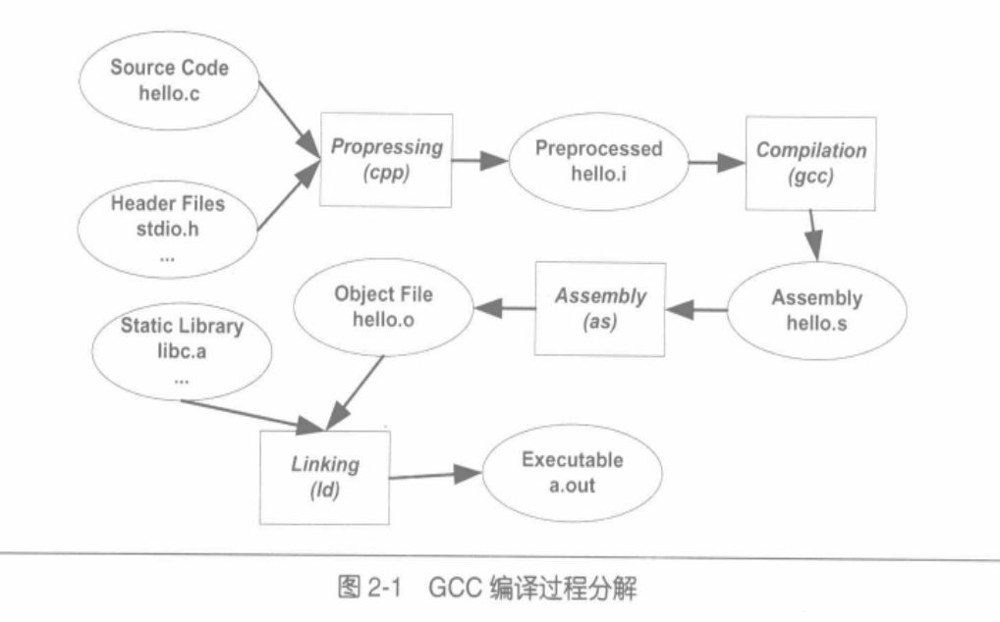


### 预编译

对源文件预编译，会生成一个.i文件

```shell
cyc@ubuntu:~/workspace/chapt2$ gcc -E hello.c -o hello.i
cyc@ubuntu:~/workspace/chapt2$ ls
a.out  hello.c  hello.i
```

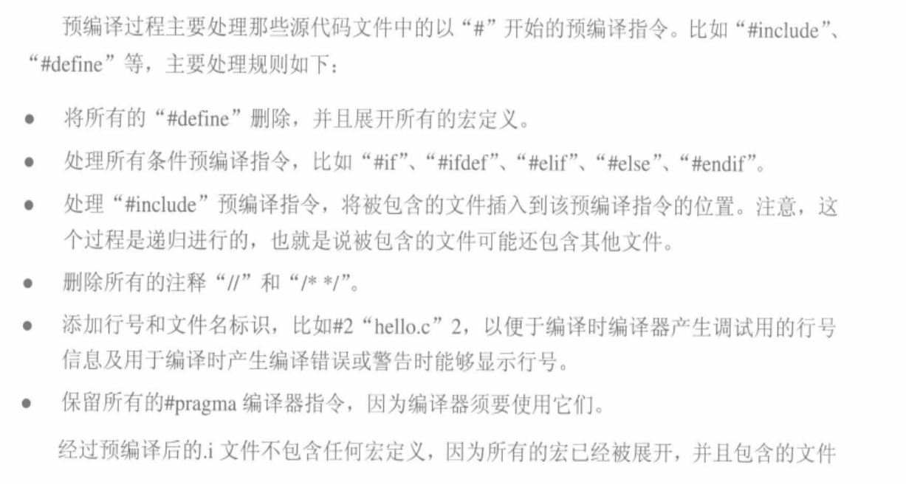


### 编译

编译就是将.c文件编译成汇编文件，生成hello .s文件

```
gcc -S hello.i -o hello.s
或者
gcc -S hello.c -o hello.s
```

### 汇编

执行下面3条中的任意一条都可以，生成目标二进制文件hello.o

```
cyc@ubuntu:~/workspace/chapt2$ gcc -c hello.s -o hello.o
cyc@ubuntu:~/workspace/chapt2$ gcc -c hello.c -o hello.o
cyc@ubuntu:~/workspace/chapt2$ as hello.s -o hello.o
```

### 链接


简单说明下各个参数的含义，-L+链接库路径，-l+链接库名称，链接又分为动态链接和静态链接，-l后面链接库的名字是省略了lib和链接库的后缀后的名称，比如-lgcc其实链接的是libgcc.a


### 模块拼装

按照一定的规则将各个.o文件，链接在一个可执行文件

## 第三章节 目标文件里有什么

### 为什么要学习elf的格式?

我感觉，可能是为了更好的理解编译原理，理解编译底层的一些东西，了解编译后的一个可执行文件中，会包含哪些东西

### 什么叫目标文件？

目标文件，就是源代码经过编译，但是未经过链接的文件，比如linux中的.o文件，windows中的.obj文件，都属于目标文件

### 什么叫做可执行文件

可执行文件，就是在目标平台上，可以执行的文件，比如linux中的elf文件，windows中的exe文件

### 可执行文件的存储格式

windows下，可执行文件的存储格式为PE-COFF格式，linux下为elf格式，通常我们关心elf格式的比较多，不光可执行文件（windows下.exe，linux下.elf）是按照可执行文件格式存储，动态链接库（windows下的.dll，linux下的.so）以及静态链接库（windows下的*.lib，linux下的*.a）都是按照可执行文件的存储格式存储的，那么我们有必要研究下可执行文件的存储格式，我们以elf可执行文件的存储格式为例子，详细介绍下elf的文件格式


### ELF文件存储格式

elf格式的文件，可以归为4类

| ELF文件类型  | 说明                                                         | 实例                                                      |
| :----------- | ------------------------------------------------------------ | --------------------------------------------------------- |
| 可重定位文件 | 包含代码和数据，可以被用来链接成可执行文件elf或者动态/静态链接链接库 | linux *.o, *.a, *.so文件，Windows *.obj, *.lib, *.dll文件 |
| 可执行文件   | 直接可执行的程序                                             | Linux中的/bin/bash中的，elf文件，windows中的exe           |
| 共享目标文件 | 包含代码和数据，和其他可重定位文件，一起链接成可执行文件     | linux *.so，windows *.dll                                 |
| 核心转储文件 | 当进程意外终止时，系统将该进程的地址空间的内容以及一些其他文件转储到核心转储文件 | linux下的Core dump文件                                    |


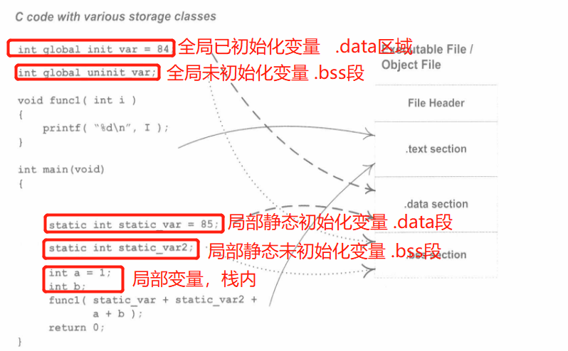

elf格式文件，有文件头，文件头描述了文件属性，包括文件是否为可执行，还是静态链接，动态练级库，如果是可执行文件的话，那么可执行文件的入口地址是多少，目标硬件，目标操作系统等信息


代码，编译后的执行语句为机器代码，保存在.text段

.bss段存放未初始化的全局变量或者未初始化的静态局部变量，或者初始化为0的全局，静态局部变量，.bss段只是为未初始化的全局变量和局部静态变量预留位置而已，在elf文件，或者bin文件中，不占用实际的空间

测试源文件

```c
// SimpleSection.c
int printf(const char *format, ...);

int global_init_var = 84;
int global_uninit_var;

void func1(int i)
{
    printf("%d\n", i);
}


int main(void)
{
    static int static_var = 85;
    static int static_var2;
    int a = 1;
    int b;
    func1(static_var + static_var2 + a + b);
    return a;
}

```

我这边的测试环境：

```shell
cyc@ubuntu:~/workspace/chapt3$ uname -a
Linux ubuntu 3.13.0-32-generic #57-Ubuntu SMP Tue Jul 15 03:51:12 UTC 2014 i686 i686 i686 GNU/Linux
```

编译源代码：

```shell
cyc@ubuntu:~/workspace/chapt3$ gcc -c SimpleSection.c   #其中-c表示只编译源文件，不链接
```

编译后生成SimpleSection.o

```shell
cyc@ubuntu:~/workspace/chapt3$ ll
total 16
drwxrwxr-x 2 cyc cyc 4096 Apr 23 09:27 ./
drwxrwxr-x 4 cyc cyc 4096 Apr 23 09:19 ../
-rw-rw-r-- 1 cyc cyc  319 Apr 23 09:16 SimpleSection.c
-rw-rw-r-- 1 cyc cyc 1312 Apr 23 09:25 SimpleSection.o
```

查看编译后的.o文件类型为可重定位类型，一般叫做目标文件，该文件类型可以被用来链接成可执行文件

```shell
cyc@ubuntu:~/workspace/chapt3$ file SimpleSection.o
SimpleSection.o: ELF 32-bit LSB  relocatable, Intel 80386, version 1 (SYSV), not stripped

```

查看编译后的目标文件所包含的段信息

```shell
cyc@ubuntu:~/workspace/chapt3$ objdump -h SimpleSection.o

SimpleSection.o:     file format elf32-i386

Sections:
段名               段占字节数                     该段在文件中的偏移
Idx Name          Size      VMA       LMA       File off  Algn
  0 .text         00000053  00000000  00000000  00000034  2**0
                  CONTENTS, ALLOC, LOAD, RELOC, READONLY, CODE
  1 .data         00000008  00000000  00000000  00000088  2**2
                  CONTENTS, ALLOC, LOAD, DATA
  2 .bss          00000004  00000000  00000000  00000090  2**2
                  ALLOC
  3 .rodata       00000004  00000000  00000000  00000090  2**0
                  CONTENTS, ALLOC, LOAD, READONLY, DATA
  4 .comment      0000002c  00000000  00000000  00000094  2**0
                  CONTENTS, READONLY
  5 .note.GNU-stack 00000000  00000000  00000000  000000c0  2**0
                  CONTENTS, READONLY
  6 .eh_frame     00000058  00000000  00000000  000000c0  2**2
                  CONTENTS, ALLOC, LOAD, RELOC, READONLY, DATA

```

接下来，我们就需要仔细的分析下编译后生成的目标文件了,这里我们主要研究.text段（代码段）.data段（全局数据段）.bss段（0数据段）其余几个段，比如.rodata段）（只读数据段）.comment(注释段) .note.GNU-stack (堆栈提示段)，.eh_frame 表示的是调试时使用的一些数据，便于展开调试，可以暂时先不关心

Size: 段的长度，单位字节

File Off ：该段的起始地址在目标文件中的偏移

CONTENTS: 段属性，表示该段在文件中存在， 一般.bss段就没有CONTENTS属性，因为bss在文件中不占用实际大小

ALLOC： 段属性，

根据文件的偏移，画出该目标文件在elf中的结构图

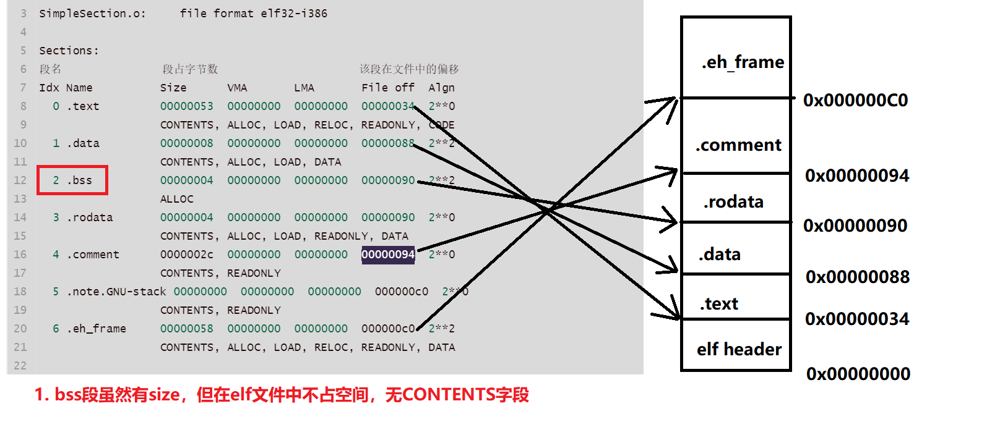

有一个专门的命令叫做size,可以查看elf文件的代码段，数据段和bss段的长度

```shell
cyc@ubuntu:~/workspace/chapt3$ size SimpleSection.o 
   text	   data	    bss	    dec	    hex	filename
    175	      8	      4	    187	     bb	SimpleSection.o
解释：
1. text 表示的是.text段和rodata段和eh_frame段的三者之和
2. data 表示的就是可读可写的数据段的长度
3. bss 表示bss段的大小
4. dec表示的是 text + data + bss
5. hex就是 dec的16进制表示

```

**查看代码段**  : -s 参数可以将所有段的内容以16进制的方式打印出来，-d参数可以将所有包含指令的段反汇编

```
cyc@ubuntu:~/workspace/chapt3$ objdump -s -d SimpleSection.o

SimpleSection.o:     file format elf32-i386

Contents of section .text:  # 该段的长度为0x53，即和上面objdump -h出来的.text段长度一致
 0000 5589e583 ec188b45 08894424 04c70424  U......E..D$...$
 0010 00000000 e8fcffff ffc9c355 89e583e4  ...........U....
 0020 f083ec20 c7442418 01000000 8b150400  ... .D$.........
 0030 0000a100 00000001 c28b4424 1801c28b  ..........D$....
 0040 44241c01 d0890424 e8fcffff ff8b4424  D$.....$......D$
 0050 18c9c3                               ...             
Contents of section .data:
 0000 54000000 55000000                    T...U...        
Contents of section .rodata:
 0000 25640a00                             %d..            
Contents of section .comment:
 0000 00474343 3a202855 62756e74 7520342e  .GCC: (Ubuntu 4.
 0010 382e342d 32756275 6e747531 7e31342e  8.4-2ubuntu1~14.
 0020 30342e34 2920342e 382e3400           04.4) 4.8.4.    
Contents of section .eh_frame:
 0000 14000000 00000000 017a5200 017c0801  .........zR..|..
 0010 1b0c0404 88010000 1c000000 1c000000  ................
 0020 00000000 1b000000 00410e08 8502420d  .........A....B.
 0030 0557c50c 04040000 1c000000 3c000000  .W..........<...
 0040 1b000000 38000000 00410e08 8502420d  ....8....A....B.
 0050 0574c50c 04040000                    .t......        

Disassembly of section .text:

00000000 <func1>:
   0:	55                   	push   %ebp
   1:	89 e5                	mov    %esp,%ebp
   3:	83 ec 18             	sub    $0x18,%esp
   6:	8b 45 08             	mov    0x8(%ebp),%eax
   9:	89 44 24 04          	mov    %eax,0x4(%esp)
   d:	c7 04 24 00 00 00 00 	movl   $0x0,(%esp)
  14:	e8 fc ff ff ff       	call   15 <func1+0x15>
  19:	c9                   	leave  
  1a:	c3                   	ret    

0000001b <main>:
  1b:	55                   	push   %ebp
  1c:	89 e5                	mov    %esp,%ebp
  1e:	83 e4 f0             	and    $0xfffffff0,%esp
  21:	83 ec 20             	sub    $0x20,%esp
  24:	c7 44 24 18 01 00 00 	movl   $0x1,0x18(%esp)
  2b:	00 
  2c:	8b 15 04 00 00 00    	mov    0x4,%edx
  32:	a1 00 00 00 00       	mov    0x0,%eax
  37:	01 c2                	add    %eax,%edx
  39:	8b 44 24 18          	mov    0x18(%esp),%eax
  3d:	01 c2                	add    %eax,%edx
  3f:	8b 44 24 1c          	mov    0x1c(%esp),%eax
  43:	01 d0                	add    %edx,%eax
  45:	89 04 24             	mov    %eax,(%esp)
  48:	e8 fc ff ff ff       	call   49 <main+0x2e>
  4d:	8b 44 24 18          	mov    0x18(%esp),%eax
  51:	c9                   	leave  
  52:	c3                   	ret 
```

.text段的第一个字节“0x55”就是func1()函数的第一条“push   %ebp” 指令，而最后一个字节0xc3就是main函数的最后一条指令“ret”

.data段保存的是那些已经初始化了的全局变量和静态局部变量，刚好是8个字节

```
就是下面这两个变量
int global_init_var = 84;
static int static_var = 85;
```

对应如下


SimpleSection.c里面，我们调用了printf的时候，用到了一个字符串常量“%d\n”,它是一种只读数据，所以被放到.rodata段，通过查阅ASSIC码表， 0x25对应的ASSIC码为%d， 0x64对应字母d, 0x0a对应\n，最后的0x0表示\0


.rodata段存放的是只读数据，一般是程序里面的只读变量，如const修饰的变量和字符串常量，一般会存放到只读存储器中，提一下，有时编译器会把字符串常量放到.data段，不常见，暂时可以忽略


.bss段，存放的是未初始化的全局变量和局部静态变量，.bss段为他们预留了空间，我们的测试程序有2个4字节的变量，按理.bss段占8个字节，但是我们看到的结果是占4个字节，与我们期望的不符，我们通过**符号表 **Symbol Table(后面介绍)，只有static_var2被放在了.bss段，而global_uninit_var却没有被放到任何段，只是一个未定义的“COMMON符号”，这其实是跟不同的语言与不同的编译器实现有关，有些编译器会将全局未初始化的变量放到.bss段，有些则不这样做，只是**预留一个未定义的全局变量符号**等到链接成可执行文件的时候，再分配到.bss段上，这个我们后续再讨论，**原则上讲我们可以简单的把它们全部认为存放在.bss段**

注意一个问题：

static int x1 = 0;

static int x2 = 1;

那么x1会被放到.bss段，x2会被放到.data段，为啥呢，这样做更加省最后的elf或者bin文件的空间


其他段


以.作为前缀的段，表示这些表的名字是系统保留的，应用程序可以使用非系统保留的段自定义，还有一些段，比如.sdata, .tdesc.sbss等等，是elf文件历史遗留问题造成的，可以不用理会，已经被遗弃了。

正常情况下，gcc编译出来的目标文件中，代码会放到.text段，全局变量和静态变量会被放到.data段和.bss段，但是当我们系统你定义的某些变量或者部分代码放到你所指定的段中去，如何实现呢？gcc提供了扩展机制，可以让程序猿指定变量所在的段

```c
__attribute__((section(“FOO”))) int global_val = 43;
__attribute__((section(“BAR”))) void foo()
{
    
}
```

我们再全局变量或者函数之前加上\_\_attribute\_\_((section(“name”))) 属性就可以把相应的变量或者函数放到“name”为段名的段中了

### ELF文件结构描述


elf格式文件最前部分时elf文件头(Section Header)，它包含了面熟整个文件的基本属性，比如elf的文件版本，目标机器型号，程序入口地址，紧接着是elf文件各个段，其中，elf文件中与段有关的重要结构就是段表（Section Header Table），该表描述了elf文件包含的所有段的信息，比如每个段的段名，段的长度，在文件中的偏移，读写权限以及段的其他属性。其他的还有字符串表，和符号表等，后续介绍


#### 文件头


```shell
cyc@ubuntu:~/workspace/chapt3$ readelf -h SimpleSection.o
ELF Header:
  Magic:   7f 45 4c 46 01 01 01 00 00 00 00 00 00 00 00 00 			#elf魔数
  Class:                             ELF32					        #目标机器字节长度
  Data:                              2's complement, little endian  #数据存储方式
  Version:                           1 (current)					#版本
  OS/ABI:                            UNIX - System V				#运行平台
  ABI Version:                       0								#ABI版本
  Type:                              REL (Relocatable file)			#elf文件类型（可重定位）
  Machine:                           Intel 80386					#硬件平台
  Version:                           0x1							#硬件平台版本
  Entry point address:               0x0							#程序入口地址
  Start of program headers:          0 (bytes into file)			#
  Start of section headers:          376 (bytes into file)			# 段表的偏移地址0x178
  Flags:                             0x0
  Size of this header:               52 (bytes)						#elf header大小 0x34
  Size of program headers:           0 (bytes)
  Number of program headers:         0
  Size of section headers:           40 (bytes)
  Number of section headers:         13
  Section header string table index: 10

```

```c
typedef struct
{
  unsigned char e_ident[EI_NIDENT];     /* Magic number and other info */
  Elf32_Half    e_type;                 /* Object file type */
  Elf32_Half    e_machine;              /* Architecture */
  Elf32_Word    e_version;              /* Object file version */
  Elf32_Addr    e_entry;                /* Entry point virtual address */
  Elf32_Off     e_phoff;                /* Program header table file offset */
  Elf32_Off     e_shoff;                /* Section header table file offset */
  Elf32_Word    e_flags;                /* Processor-specific flags */
  Elf32_Half    e_ehsize;               /* ELF header size in bytes */
  Elf32_Half    e_phentsize;            /* Program header table entry size */
  Elf32_Half    e_phnum;                /* Program header table entry count */
  Elf32_Half    e_shentsize;            /* Section header table entry size */
  Elf32_Half    e_shnum;                /* Section header table entry count */
  Elf32_Half    e_shstrndx;             /* Section header string table index */
} Elf32_Ehdr;

```


elf文件类型有3种：


#### 段表


段表，就是保存elf文件中各个段的属性信息的结构，段表是elf文件中除了文件头以外最重要的结构，他描述了elf各个段的信息，比如每个段的段名，段的长度，在文件中的偏移，读写权限及段的其他属性，elf文件的段的结构就是由段表决定的，编译器，连接器，装载器等都是依靠段表来定位和访问各个段的属性的，段表在elf文件中的位置由elf文件头中的e_shoff成员决定

前面我们了解到的段，其实是比较重要的一些段，但并不完整，使用如下命令查看elf文件中，完整的段信息


```shell
cyc@ubuntu:~/workspace/chapt3$ readelf -S SimpleSection.o
There are 13 section headers, starting at offset 0x178:

Section Headers:
  [Nr] Name              Type            Addr     Off    Size   ES Flg Lk Inf Al
  [ 0]                   NULL            00000000 000000 000000 00      0   0  0
  [ 1] .text             PROGBITS        00000000 000034 000053 00  AX  0   0  1 #
  [ 2] .rel.text         REL             00000000 0004e8 000028 08     11   1  4 #
  [ 3] .data             PROGBITS        00000000 000088 000008 00  WA  0   0  4
  [ 4] .bss              NOBITS          00000000 000090 000004 00  WA  0   0  4
  [ 5] .rodata           PROGBITS        00000000 000090 000004 00   A  0   0  1
  [ 6] .comment          PROGBITS        00000000 000094 00002c 01  MS  0   0  1
  [ 7] .note.GNU-stack   PROGBITS        00000000 0000c0 000000 00      0   0  1
  [ 8] .eh_frame         PROGBITS        00000000 0000c0 000058 00   A  0   0  4
  [ 9] .rel.eh_frame     REL             00000000 000510 000010 08     11   8  4
  [10] .shstrtab         STRTAB          00000000 000118 00005f 00      0   0  1
  [11] .symtab           SYMTAB          00000000 000380 000100 10     12  11  4
  [12] .strtab           STRTAB          00000000 000480 000066 00      0   0  1
Key to Flags:
  W (write), A (alloc), X (execute), M (merge), S (strings)
  I (info), L (link order), G (group), T (TLS), E (exclude), x (unknown)
  O (extra OS processing required) o (OS specific), p (processor specific)

```

使用readelf输出的结果就是elf文件表的内容，那么就让我们对照这个输出来看看段表的结构，段表的结构比较简单，他是一个以“Elf32_Shdr”结构体为元素的数组。我们这里，该数组的长度是13，其中第一个段表，即index为0的，类型为NULL,是一个无效的段表（段描述符），其余12个都是有效的段

段表结构体如下，在32位机器中，每个段表占用的字节数固定为40个字节

```c
/* Section header.  */

typedef struct
{
  Elf32_Word    sh_name;                /* Section name (string tbl index) */ 段名
  Elf32_Word    sh_type;                /* Section type */					  段类型
  Elf32_Word    sh_flags;               /* Section flags */					  段标志
  Elf32_Addr    sh_addr;                /* Section virtual addr at execution */ 段虚拟地址
  Elf32_Off     sh_offset;              /* Section file offset */		段在文件中的偏移
  Elf32_Word    sh_size;                /* Section size in bytes */		段长度
  Elf32_Word    sh_link;                /* Link to another section */	段链接信息
  Elf32_Word    sh_info;                /* Additional section information */ 段额外信息
  Elf32_Word    sh_addralign;           /* Section alignment */			 段地址对齐
  Elf32_Word    sh_entsize;             /* Entry size if section holds table */ 
} Elf32_Shdr;

```

elf文件细节剖析：


#### 段类型说明


结合前面获取到的段信息，对应上面的表格，可以知道对应的段类型

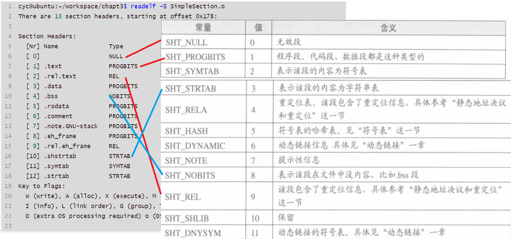

#### 段标志

段标志，表示对应的段，在进程虚拟地址空间中的属性，比如是否可写，可执行等


#### 重定位表

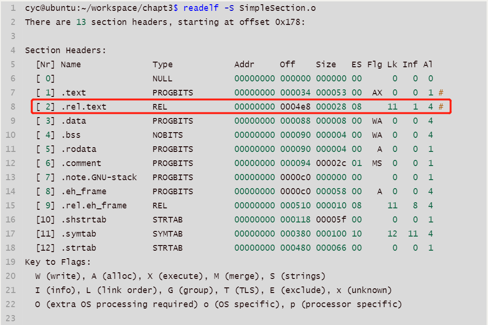

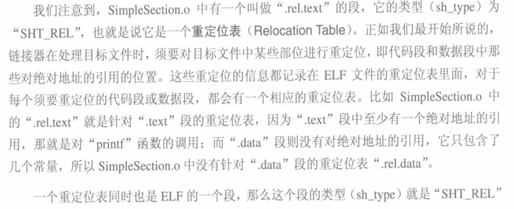


#### 字符串表

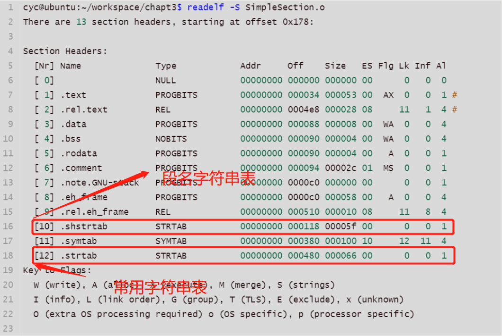


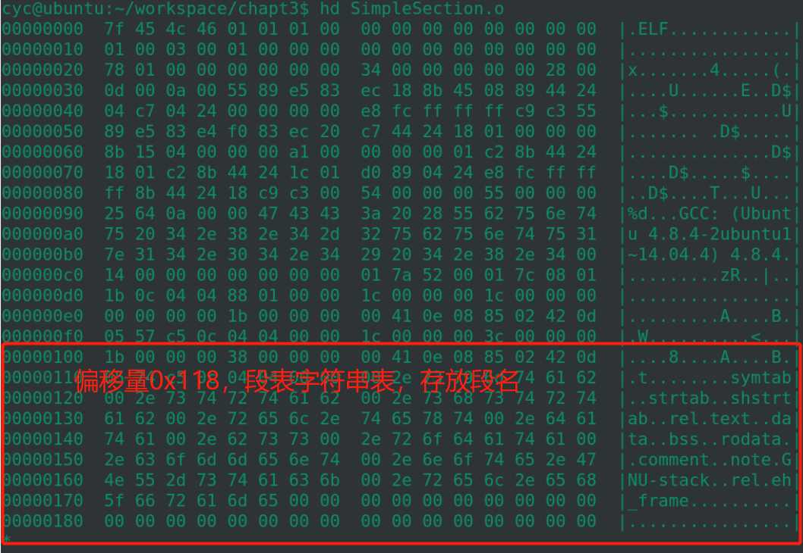


常规字符串表

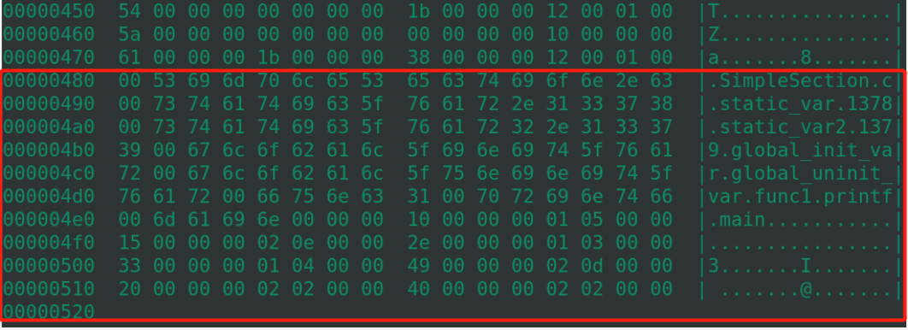

### 链接的接口-符号

连接过程的本质，就是把多个不同的目标.o文件，相互“粘”在一起，或者说想搭积木一样，拼装成一个整体，为了使得不同的目标文件之前能够相互拼装，这些目标文件之间必须有固定的规则才行，在链接中，目标文件之间的相互拼装，实际是目标文件之间对地址的引用，即对函数或者变量的地址的引用，比如目标文件B中用到了目标文件A中的函数foo，那么我们就成目标文件A定义了foo函数，成目标B引用了目标A中的函数foo,对变量同样适用，每个函数和变量都有自己独特的名字，才能避免在链接过程中不同变量和函数之间的混淆，在链接中，我们将函数和变量统称为**符号**，函数名或者变量名就是**符号名**

每个目标文件都有相应的**符号表**，这个符号表记录目标文件中的所有用到的符号，每个定义的符号有一个对应的值，叫做**符号值**，对于变量和函数来说，符号值就是他们的地址，除了函数和变量之外，还存在其他几种不常用到的符号

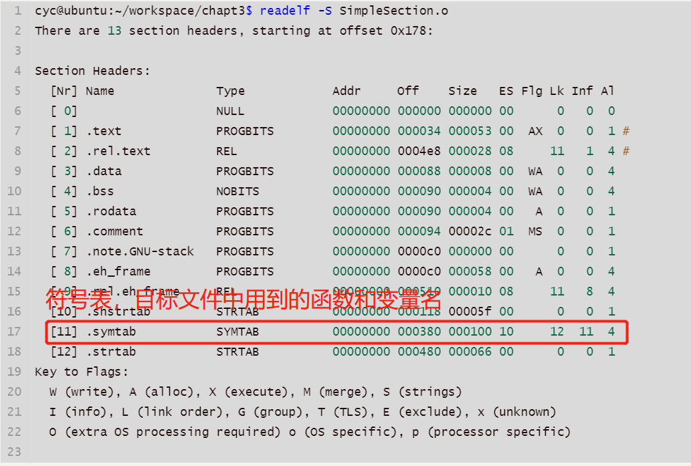


符号表中的所有的符号（符号名和符号值），进行分类：

- 定义在本目标文件的全局符号，可以被其他目标引用，比如func1,main,global_init_var
- 在本目标文件中引用的全局符号，却没有定义在本目标文件中的，一般叫做**外部符号**，也就是我们讲的引用的符号，比如printf
- 段名，这种符号往往是由编译器产生，它的值就是该段的起始地址，比如.text段的值就是0x34
- 局部符号，这类符号只在编译单元内部可见
- 行号信息，即目标文件指令与源代码行的对应关系，可选

对于我们来说，最值得关注的就是全局符号，即上面的第一和第二类，因为连接过程值关系全局符号的相互拼装，

查看elf文件的符号表

```shell
cyc@ubuntu:~/workspace/chapt3$ nm SimpleSection.o
00000000 T func1				# T表示符号位于text段
00000000 D global_init_var		# D表示符号位于.data段
00000004 C global_uninit_var	# C表示未初始化数据段
0000001b T main					
         U printf				# U表示该符号在当前目标文件中没有定义
00000004 d static_var.1378		# d表示静态已初始化变量
00000000 b static_var2.1379		# b表示静态未初始化变量
cyc@ubuntu:~/workspace/chapt3$ 
```

#### 符号表结构

```c
/* Symbol table entry.  */

typedef struct
{
  Elf32_Word    st_name;                /* Symbol name (string tbl index) */  符号名
  Elf32_Addr    st_value;               /* Symbol value */					  符号值
  Elf32_Word    st_size;                /* Symbol size */					  符号大小
  unsigned char st_info;                /* Symbol type and binding */ 符号类型和绑定信息
  unsigned char st_other;               /* Symbol visibility */ 忽略
  Elf32_Section st_shndx;               /* Section index */	   符号所在的段
} Elf32_Sym;

```

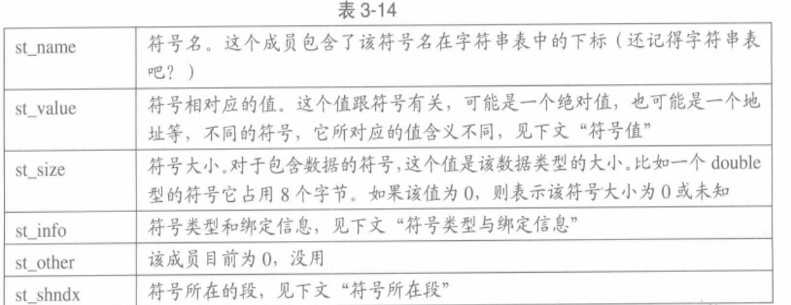


符号类型和绑定信息：

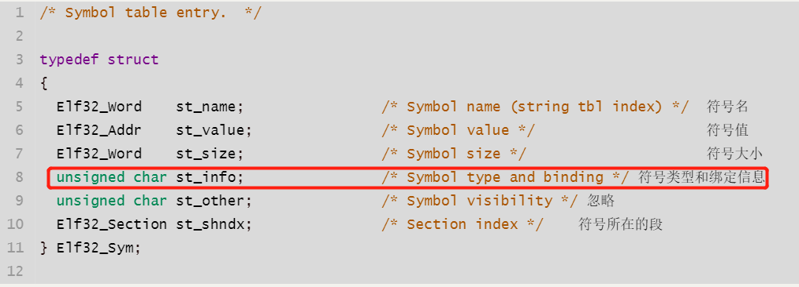

一个无符号 8bit数据，低4bit（0~0xf）表示符号的类型

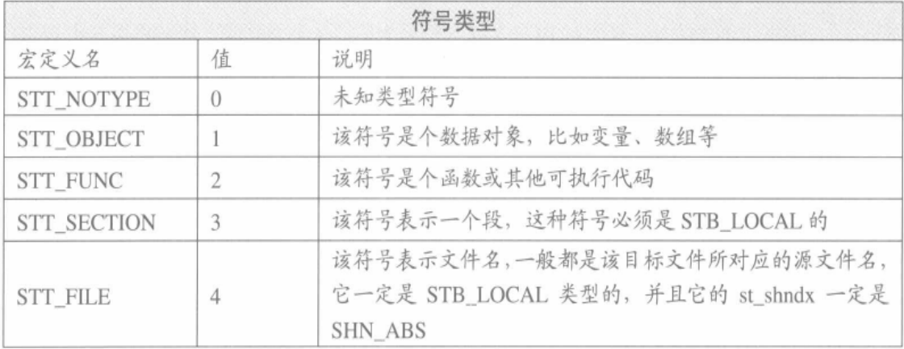

高4bit表示符号绑定信息


查看符号表信息：

```shell
cyc@ubuntu:~/workspace/chapt3$ readelf -s SimpleSection.o 

Symbol table '.symtab' contains 16 entries:
   Num:    Value  Size Type    Bind   Vis      Ndx Name
     0: 00000000     0 NOTYPE  LOCAL  DEFAULT  UND 
     1: 00000000     0 FILE    LOCAL  DEFAULT  ABS SimpleSection.c
     2: 00000000     0 SECTION LOCAL  DEFAULT    1 
     3: 00000000     0 SECTION LOCAL  DEFAULT    3 
     4: 00000000     0 SECTION LOCAL  DEFAULT    4 
     5: 00000000     0 SECTION LOCAL  DEFAULT    5 
     6: 00000004     4 OBJECT  LOCAL  DEFAULT    3 static_var.1378
     7: 00000000     4 OBJECT  LOCAL  DEFAULT    4 static_var2.1379
     8: 00000000     0 SECTION LOCAL  DEFAULT    7 
     9: 00000000     0 SECTION LOCAL  DEFAULT    8 
    10: 00000000     0 SECTION LOCAL  DEFAULT    6 
    11: 00000000     4 OBJECT  GLOBAL DEFAULT    3 global_init_var
    12: 00000004     4 OBJECT  GLOBAL DEFAULT  COM global_uninit_var
    13: 00000000    27 FUNC    GLOBAL DEFAULT    1 func1
    14: 00000000     0 NOTYPE  GLOBAL DEFAULT  UND printf
    15: 0000001b    56 FUNC    GLOBAL DEFAULT    1 main

```


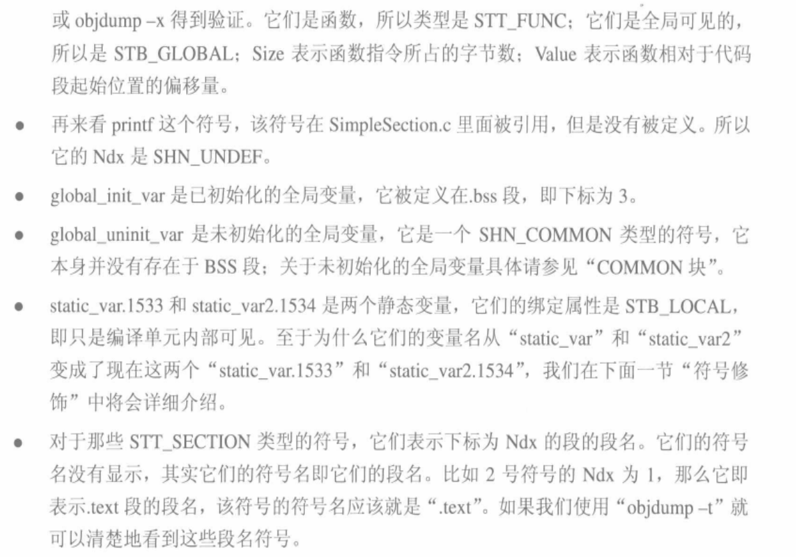


#### 符号修饰与函数签名

就是我们在程序中定义了一个变量或者函数，编译器编译后的符号可能会额外统一加上一些前后缀

#### 强符号与弱符号

未初始化的全局变量以及显示声明为弱符号的变量或者函数，称为弱变量，弱函数

初始化的全局变量或者未显示声明为弱符号的变量或者函数，称为强符号

显示声明，gcc中，使用\_\_attribute\_\_((weak))来定义

### 调试信息

目标文件中还有可能保存的是调试信息，比如设置断点，监视变量变化等，先忽略讲解

附件：下面截图是目标文件的二进制格式

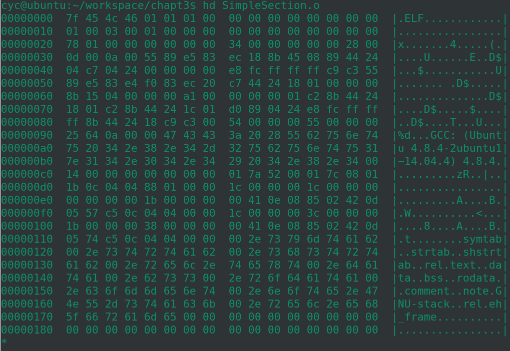

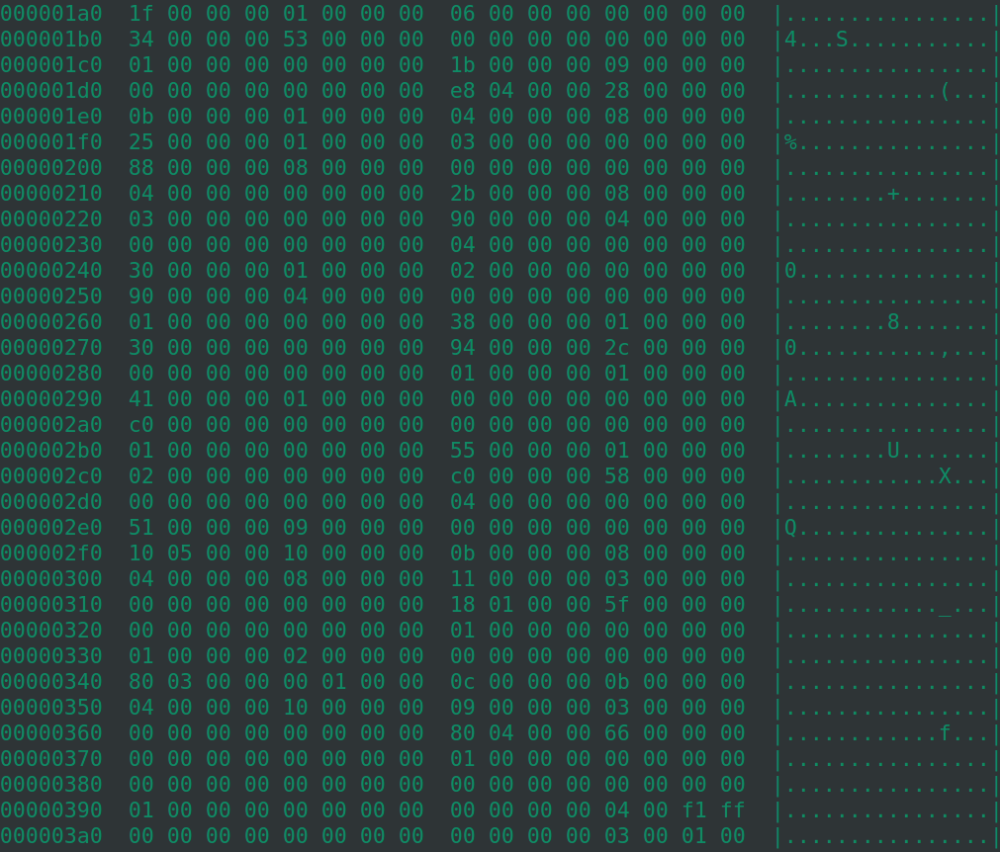

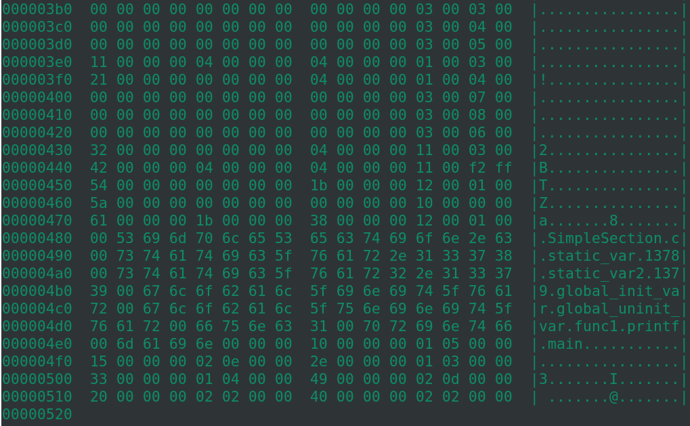


## 