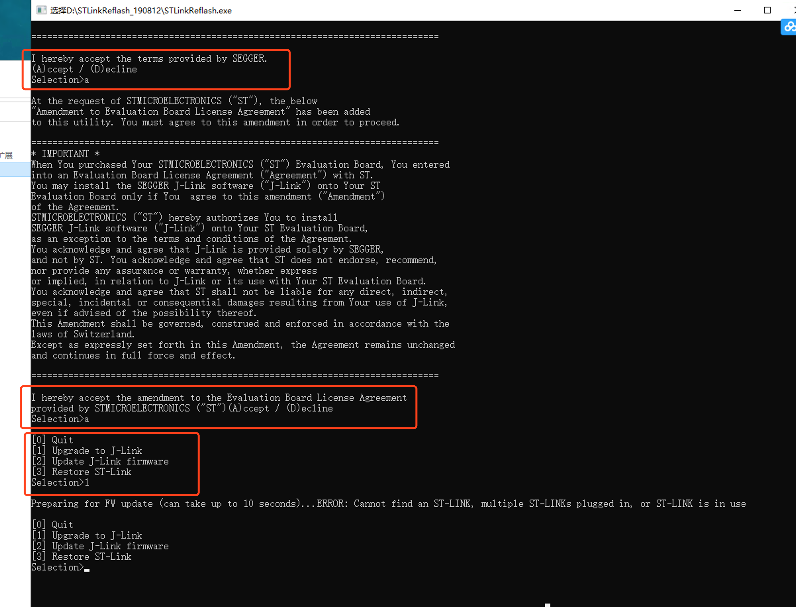

# 在MacOS下编译烧录ART-Pi

## 一、前言

[ART-Pi](https://art-pi.gitee.io/website/)是RT-Thread设计的一款搭载`STM32H750XBH6` 主控的开发板，由于STM32宣称 `STM32H750XBH6` 仅有128KB片内flash（[实际上并不是](https://club.rt-thread.org/ask/article/2314.html)），所以`ART-Pi SDK`使用128KB片内flash当作bootloader，将app程序放到8MB的片外QSPI flash上面运行。

`ART-Pi SDK`可以在`RT-Thread Studio`、`MDK` 等IDE上完美使用，但是这一切都是基于Windows。但是当我看到[这篇文章](https://club.rt-thread.org/ask/article/2348.html)的时候，我就知道`ART-Pi` 跨平台开发的机会来了。

## 二、环境要求

1. 装有MacOS的电脑或虚拟机
2. 装有Windows的电脑或虚拟机

需要用到的资源如下**：**

- [ART-Pi SDK](https://github.com/RT-Thread-Studio/sdk-bsp-stm32h750-realthread-artpi)
- [scons](https://scons.org/pages/download.html)
- [Arm GUN 工具链](https://developer.arm.com/tools-and-software/open-source-software/developer-tools/gnu-toolchain/gnu-rm/downloads)
- [SEGGER J-Link software](https://www.segger.com/downloads/jlink/#J-LinkSoftwareAndDocumentationPack)
- [RT-Thread Env](https://github.com/RT-Thread/env)
- [ST-Link Reflash](https://www.segger.com/downloads/jlink#STLink_Reflash)

## 三、开搞

### 3.1 将板载ST-Link刷成J-Link

`ART-Pi`板载了一个`ST-Link` ，但是经过测试`ST-Link` 在非Windows系统上使用并不友好，所以需要将其重置为`J-Link` 以便烧录程序。

这一步需要在Windows上完成，因为ST-Link Reflash工具目前只有Windows版本。

具体操作步骤如下：

- 下载安装[ST-Link Reflash](https://www.segger.com/downloads/jlink#STLink_Reflash)。
- 连接`ART-Pi` ，启动`STLinkReflash.exe` 。
- 如下图所示，`输入a回车`、`输入a回车`、`输入1回车` ，第三步千万**不要**选择`2.Update J-LINK firmware` ，否则无法通过USB刷回`ST-Link` 。



正常情况下，板子上的`ST-Link`已经变成`J-Link` 了，我的ART-Pi已经刷过`J-Link`了所以提示找不到`ST-LINK` 。不要问为什么不刷回`ST-Link` 重刷截图，问就是懒。

### 3.2 编译下载Bootloader

接下来配置SDK和编译环境，进行Bootloader的编译和烧录。

- 使用`brew install scons` ，安装scons编译工具。
- 下载[SEGGER J-Link software](https://www.segger.com/downloads/jlink/#J-LinkSoftwareAndDocumentationPack)，用于烧录调试。
- 使用`git clone https://github.com/RT-Thread-Studio/sdk-bsp-stm32h750-realthread-artpi`克隆[ART-Pi SDK](https://github.com/RT-Thread-Studio/sdk-bsp-stm32h750-realthread-artpi)到本地目录。
- 下载解压[Arm GUN 工具链](https://developer.arm.com/tools-and-software/open-source-software/developer-tools/gnu-toolchain/gnu-rm/downloads)。
- （可选）克隆[RT-Thread Env](https://github.com/RT-Thread/env)到本地目录，主要用于开发阶段pkgs管理等操作。
- 设置环境变量，建议添加到`.zshrc` 或`.bashrc`

    ```bash
    export RTT_CC=gcc
    export RTT_EXEC_PATH=<ARM GUN工具链地址，包含bin目录>
    ```

- 使用命令行进入`ART-Pi SDK`的`projects/art_pi_bootloader` 目录，这里是ART-Pi的Bootloader项目，输入`scons -c` 清除编译文件之后输入`scons` 命令编译Bootloader。编译成功后使用`<工具链路径>/arm-none-eabi-objcopy -O ihex rt-thread.elf rt-thread.hex` 得到hex文件。
- 打开JFlashLite，选择驱动为`STM32H750XB` ，刚刚编译的hex文件烧录到`0x08000000` 。


### 3.3 编译APP

使用命令行进入`ART-Pi SDK`的`projects/art_pi_blink_led` 目录，同样使用`scons` 编译项目，编译后使用同样的方法得到hex文件。这个目录是作为demo的点灯app，开发时可以替换成自己的项目。

值得一提的是app是烧录到片外flash的，所以ROM的起始地址是`0x90000000` 。并且app代码内需要加入调转到该地址的向量表（这里只是作为讲解，main.c中已有无需再添加），代码如下非常简单：

```bash
#include "stm32h7xx.h"
static int vtor_config(void)
{
    /* Vector Table Relocation in Internal QSPI_FLASH */
    SCB->VTOR = QSPI_BASE;
    return 0;
}
INIT_BOARD_EXPORT(vtor_config);
```

### 3.4 新增J-Link Device

- 找到J-Link Software的主文件夹，参考方法如下：

```bash
➜  ~ which JLinkExe
/usr/local/bin/JLinkExe
➜  ~ ll /usr/local/bin/JLinkExe
lrwxr-xr-x  1 root  wheel    41B Mar  7  2020 /usr/local/bin/JLinkExe -> /Applications/SEGGER/JLink_V660e/JLinkExe
➜  ~ cd /Applications/SEGGER/JLink_V660e
```

- 在`ART-Pi SDK`中找到`ART-Pi_W25Q64.FLM` 文件，复制到Jlink下的`Devices/ST/STM32H7` 文件夹，并改名为`ART-Pi_W25Q64.elf` 。

```bash
➜  cd Devices/ST/STM32H7
➜  mdfind ART-Pi_W25Q64.FLM
/Users/jiy/work/sdk-bsp-stm32h750-realthread-artpi/debug/flm/ART-Pi_W25Q64.FLM
/Users/jiy/work/sdk-bsp-stm32h750-realthread-artpi/libraries/touchgfx_lib/readme.md
➜ sudo cp /Users/jiy/work/sdk-bsp-stm32h750-realthread-artpi/debug/flm/ART-Pi_W25Q64.FLM ART-Pi_W25Q64.elf
➜ ll
total 2176
-rwxr-xr-x  1 root  wheel   1.0M Feb  8 14:20 ART-Pi_W25Q64.elf
-rw-r--r--  1 root  wheel    36K Dec 16  2019 ST_STM32H745I_Disco_QSPI.elf
-rw-r--r--  1 root  wheel    36K Dec 16  2019 ST_STM32H753_Eval_QSPI.elf
-rw-r--r--  1 root  wheel   1.1K Dec 16  2019 ST_STM32H7xx.pex
```

- 找到`JLinkDevices.xml` 文件，备份，然后使用sudo权限编辑。

```bash
➜  mdfind JLinkDevices.xml
/Applications/SEGGER/JLink_V660e/JLinkDevices.xml
➜  cd /Applications/SEGGER/JLink_V660e
➜  sudo cp JLinkDevices.xml JLinkDevices.xml.bak
➜  sudo vim JLinkDevices.xml
```

- 然后加入`ART-Pi` 的Device。

```bash
  <Device>
    <ChipInfo Vendor="ST" Name="ART-PI" Core="JLINK_CORE_CORTEX_M7" WorkRAMAddr="0x20000000" WorkRAMSize="0x10000" JLinkScriptFile="Devices/ST/STM32H7/ST_STM32H7xx.pex"/>
    <FlashBankInfo Name="QSPI Flash" BaseAddr="0x90000000" MaxSize="0x00800000" Loader="Devices/ST/STM32H7/ART-Pi_W25Q64.elf" LoaderType="FLASH_ALGO_TYPE_OPEN" />
  </Device>
```

### 3.5 使用JFlashLite烧录程序

这时候关闭`JFlashLite` ，然后重新打开，在驱动里面找到刚刚添加的`ART-Pi` 。

烧录刚刚编译的app，然后重启`ART-Pi`。


发现板子上的灯闪了，最后把板子拔下来装到盒子里，放到一个不容易落灰的地方吧。

## 四、参考资料

- [使用 ART-Pi(STM32H750) 片外8M 之JLINK](https://club.rt-thread.org/ask/article/2348.html)