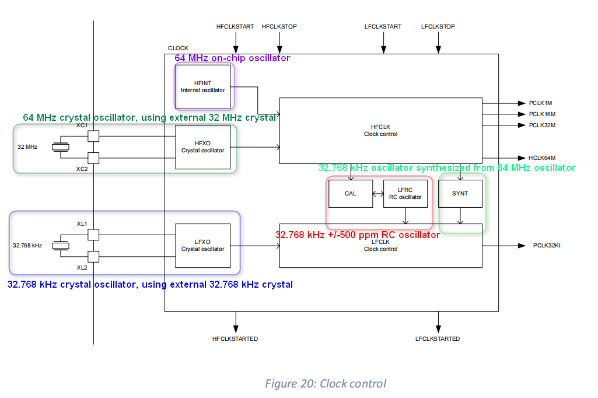
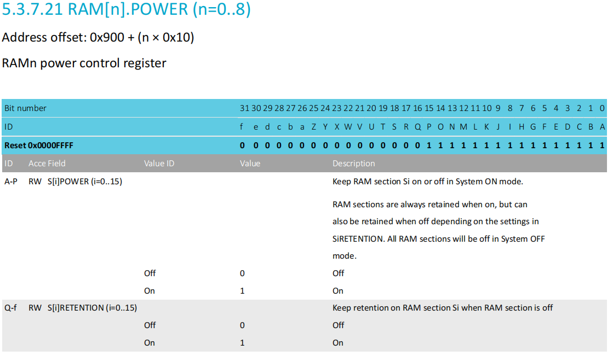
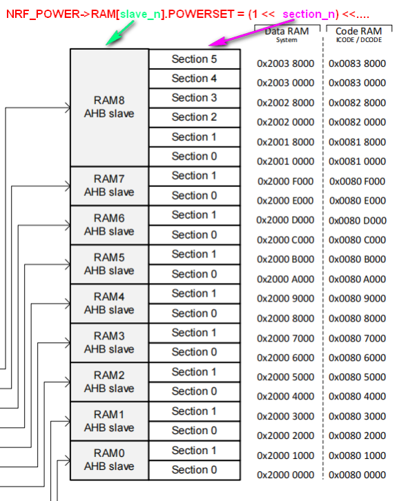
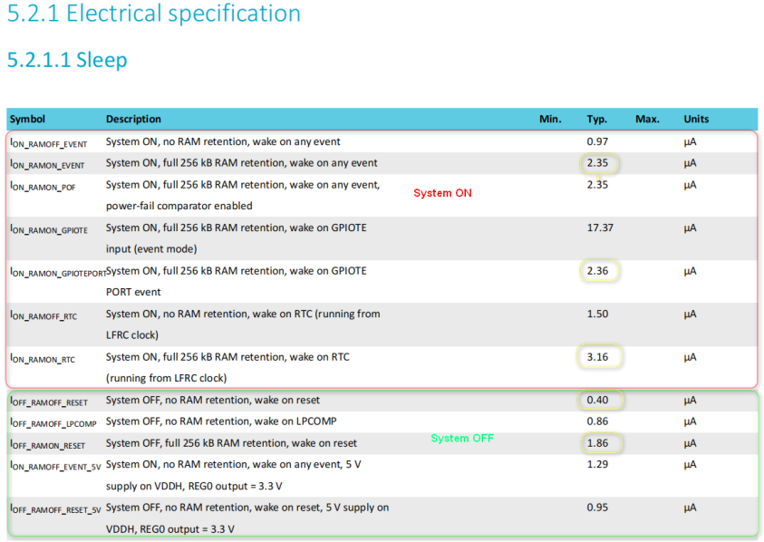
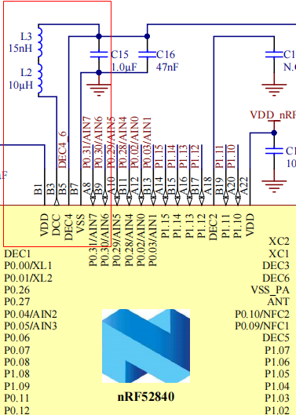

# Nrf52xx_power_pm

## 1 前言
nRF52系列是一个面向低功耗蓝牙（BLE）的低功耗射频SoC，具有相对明确的应用场景，从nRF52用户功耗控制方式来看，nRF52芯片内部的功耗设计相对于STM32L等低功耗MCU来说，优化了电源功耗设计，简化了用户的功耗处理。

 nRF52832电源管理特点 &  nRF52840电源管理特点

## 2 nRF52系列的低功耗相关硬件特性
### 2.1 功耗模式
nRF52系列定义两种功耗模式：SYSTEM_ON 和 SYSTEM_OFF。其中SYSTEM ON又可分为两种电源子模式Constant Latency与Low Power
具体可参考nRF  Product Specification
 ,如“nRF52840_PS_v1.2 5.3.3 System OFF mode、5.3.4 System ON mode"。


#### 2.1.1 SYSTEM ON mode
> nRF52840_PS_v1.2:
> 5.3.4 System ON mode 
> System ON is the default state after power-on reset. In System ON mode, all functional blocks such as the RESETREAS on page 74 provides information about the source causing the wakeup or reset.

- SYSTEM ON分为两种电源子模式(sub-power mode)：
   - Constant Latency
      - 在 Constant Latency子模式下，CPU唤醒延迟和PPI任务响应保持恒定并保持最低，代价是增加了功耗(通过强制在睡眠中打开一组基本资源来确保这一点)。
      - 通过触发CONSTLAT任务选择Constant Latency子模式：
>          - nrf_power_task_trigger(NRF_POWER_TASK_CONSTLAT) 或者
>          - NRF_POWER->TASKS_CONSTLAT = 1

   - Low-power
      - 在Low-power子模式下，自动电源管理系统确保选择最有效的供电选项，以节省能耗。具有尽可能低功耗，代价是CPU唤醒延迟和PPI任务响应的变化。
      - 通过触发LOWPWR任务来选择Low-power子模式：
>          - nrf_power_task_trigger(NRF_POWER_TASK_LOWPWR) 或者
>          - NRF_POWER->TASKS_LOWPWR = 1;

- 在SYSTEM ON模式下，当CPU和所有外围设备处于空闲模式时，系统进入两种电源子模式之一（默认处于Low-power子模式）
- SYSTEM ON模式下，RAM数据默认保持
   - 可以通过RETENTION寄存器设置为RAM不保持，以进一步降低功耗。
- 外设中断唤醒
   - 系统在计时器、外围设备或pin中断时重新启动

#### 2.1.2 SYSTEM OFF mode
> nRF52840_PS_v1.2:
> 5.3.3 System OFF mode 
> System OFF is the deepest power saving mode the system can enter. In this mode, the system’s core 
> functionality is powered down and all ongoing tasks are terminated. 

- SYSTEM OFF模式
   - 正如其名，相当于系统关机，类似STM32L系列的Standby模式
   - RAM等数据默认不保持
      - 可以通过RETENTION寄存器设置RAM保持
   - 系统进入System OFF后，可以通过以下方式进行唤醒
         1. GPIO产生的DETECT信号
         1. LPCOMP模块产生的ANADETECT信号
         1. NFC模块产生的SENSE信号
         1. VBUS
         1. Reset
   - 从 SYSTEM OFF 模式中唤醒程序会发生复位

### 2.2 nRF52xx系统时钟

### 2.3 nRF52xx的低功耗定时器RTC(Real Time Counter)

nrf52xx RTC(Real-Time Counter)外设，是低功耗实时计数器，即低功耗定时器，而不是实时时钟（Real Time Clock），即不具备万年历功能（因此对于需要掉电保存时间戳的应用，需要使用RAM保持的功耗模式）

nRF52840片内集成了3个RTC.(RTC0、RTC1、RTC2)，都是24位计数器，并带有12位分频器，可产生TICK事件、OVRFLW(溢出)事件、COMPARE(比较)事件等。
nRF52840的RTC使用LFCLK(32.768kHz)作为时钟源。

### 2.4 电源管理单元PMU

nrf52xx通过 PMU( Power Management Unit)自动检测系统时钟与外设电源，实现低功耗管理。同时可以根据需要，设置SYSTEM ON与SYSTEM OFF两种模式,RAM是否保持( RAM retention)。

#### 2.4.1 低功耗情况下的RAM控制
相对RAM不保持，RAM保持大致会增加1~1.5uA的功耗。




```c
NRF_POWER->RAM[0].POWERSET = (POWER_RAM_POWER_S0POWER_On << POWER_RAM_POWER_S0POWER_Pos)...  
```

### 2.5 nRF52xx功耗指标


- SYSTEM ON典型功耗：
   - 1.9uA (nRF52832 @ no RAM retention，RTC on, LFCLK on) 
   - 1.5uA(nRF52840 @ no RAM retention，RTC on, LFCLK on)
   - 3.16uA(nRF52840 @ RAM retention，wake on RTC)
- STSTEM OFF典型功耗：
   - 0.3uA (nRF52832 @ no RAM retention， wake on reset)
   - 0.4uA (nRF528340 @ no RAM retention， wake on reset)
## 3 硬件电路的相关功耗设计
nRF52系统支持2种稳压器供电方式，这两种供电方式需要搭配不同的硬件电路配置。

- Low-dropout regulator (LDO) 
   - 电压纹波更小，可以带来更好的射频性能，但是电源效率较低，不适合对功耗要求特别高的应用场合
- Buck regulator (DC/DC) 
   - DC-DC电源效率更高，具有更低的电流消耗，但 DC/DC本身的开关频率带来纹波较大，需要添加外部 LC 滤波器进行滤波

LDO 是系统默认的稳压器，DC/DC 稳压器可用作 LDO 稳压器的替代产品。

nRF52840 DK 支持LDO与DC-DC两种电源供电方式
由于默认选择的是内部 LDO 稳压器，因此如果需要切换到使用内部 DC/DC 稳压器，还需要在软件上进行配置。
首先需要在主函数 main.c 中，初始化 softDevice 协议栈前，执行 NRF_POWER->DCDCEN=1。或者在初始化softDevice 协议栈后，执行 sd_power_dcdc_mode_set(1)。
