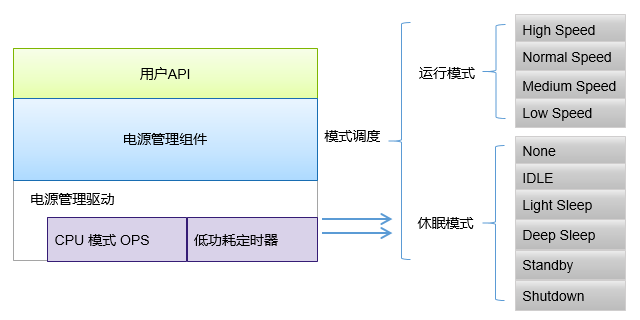
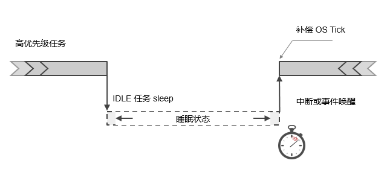
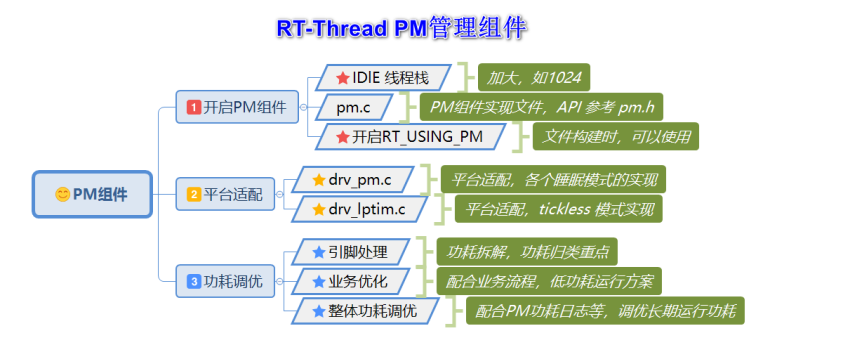
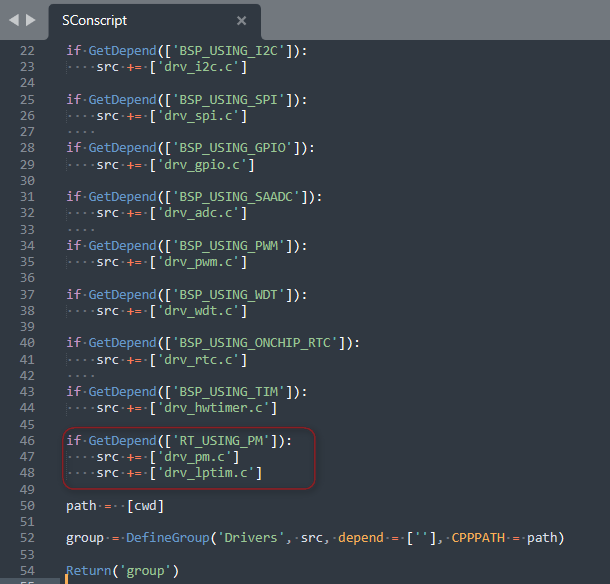
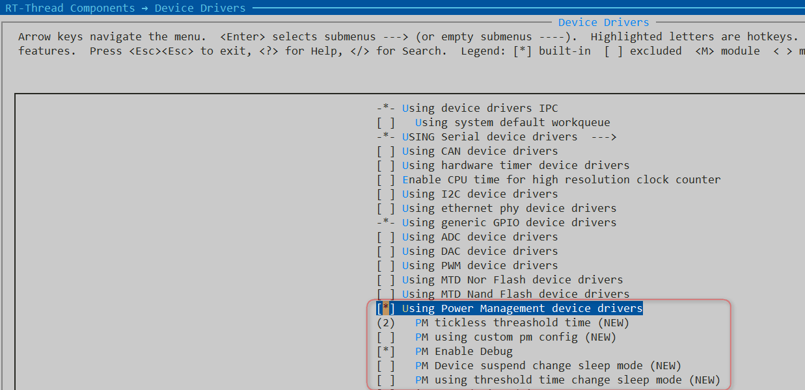
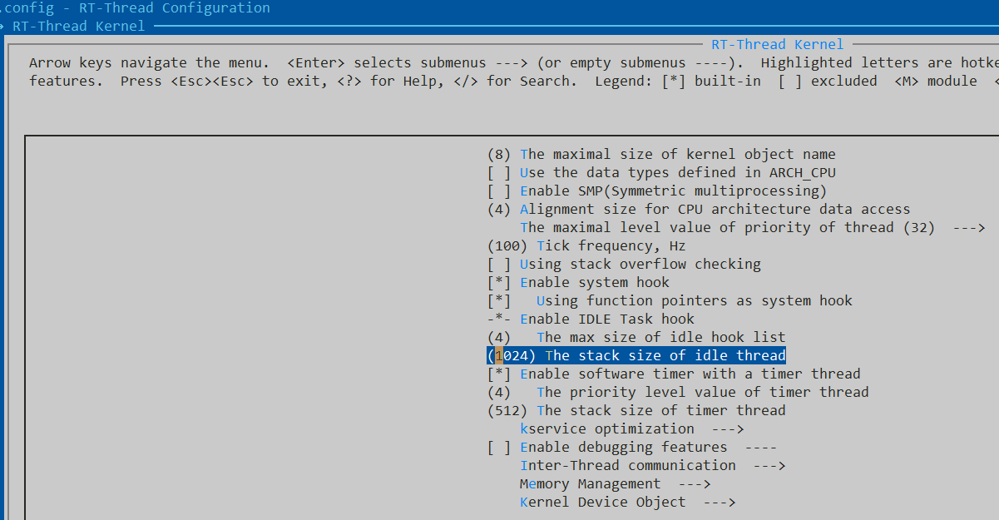

# 1 前言
本文主要描述了nRF52系列适配RT-Thread PM2.0组件。目前基于nrf52840 DK进行初步功能测试。
# 2 RT-Thread PM组件简介
本章节内容摘自RT-Thread官方文档《[电源管理组件](https://www.rt-thread.org/document/site/#/rt-thread-version/rt-thread-standard/programming-manual/pm/pm?id=%e7%94%b5%e6%ba%90%e7%ae%a1%e7%90%86%e7%bb%84%e4%bb%b6)》

- [https://www.rt-thread.org/document/site/#/rt-thread-version/rt-thread-standard/programming-manual/pm/pm](https://www.rt-thread.org/document/site/#/rt-thread-version/rt-thread-standard/programming-manual/pm/pm)

RT-Thread 的 PM 组件采用分层设计思想，分离架构和芯片相关的部分，提取公共部分作为核心。在对上层提供通用的接口同时，也让底层驱动对组件的适配变得更加简单。


## 2.1 [工作原理](https://www.rt-thread.org/document/site/#/rt-thread-version/rt-thread-standard/programming-manual/pm/pm?id=%e5%b7%a5%e4%bd%9c%e5%8e%9f%e7%90%86)
低功耗的本质是系统空闲时 CPU 停止工作，中断或事件唤醒后继续工作。在 RTOS 中，通常包含一个 IDLE 任务，该任务的优先级最低且一直保持就绪状态，当高优先级任务未就绪时，OS 执行 IDLE 任务。一般地，未进行低功耗处理时，CPU 在 IDLE 任务中循环执行空指令。RT-Thread 的电源管理组件在 IDLE 任务中，通过对 CPU 、时钟和设备等进行管理，从而有效降低系统的功耗。


## 2.2 [设计架构](https://www.rt-thread.org/document/site/#/rt-thread-version/rt-thread-standard/programming-manual/pm/pm?id=%e8%ae%be%e8%ae%a1%e6%9e%b6%e6%9e%84)
在 RT-Thread PM 组件中，外设或应用通过投票机制对所需的功耗模式进行投票，当系统空闲时，根据投票数决策出合适的功耗模式，调用抽象接口，控制芯片进入低功耗状态，从而降低系统功耗。当未进行任何投票时，会以默认模式进入(通常为空闲模式)。与应用不同，某些外设可能在进入低功耗状态时执行特定操作，退出低功耗时采取措施恢复，此时可以通过注册PM设备来实现。通过注册 PM 设备，在进入低功耗状态之前，会触发注册设备的 suspend 回调，开发者可在回调里执行自己的操作；类似地，从低功耗状态退出时，也会触发 resume 回调。


## 2.3 [低功耗状态和模式](https://www.rt-thread.org/document/site/#/rt-thread-version/rt-thread-standard/programming-manual/pm/pm?id=%e4%bd%8e%e5%8a%9f%e8%80%97%e7%8a%b6%e6%80%81%e5%92%8c%e6%a8%a1%e5%bc%8f)
RT-Thread PM 组件将系统划分为两种状态:**运行状态(RUN**)和**休眠状态(Sleep)**。 运行状态控制 CPU 的频率，适用于变频场景；休眠状态根据 SOC 特性实现休眠 CPU，以降低功耗。两种状态分别使用不同的 API 接口，独立控制。
### 2.3.1 休眠状态
休眠状态也就是通常意义上的低功耗状态，通过关闭外设、执行 SOC 电源管理接口，降低系统功耗。 休眠状态又分为六个模式，呈现为金字塔的形式。随着模式增加，功耗逐级递减的特点。下面是休眠状态下模式的定义，开发者可根据具体的 SOC 实现相应的模式，但需要遵循功耗逐级降低的特点。

| 模式 | 级别 | 描述 |
| --- | --- | --- |
| PM_SLEEP_MODE_NONE | 0 | 系统处于活跃状态，未采取任何的降低功耗状态 |
| PM_SLEEP_MODE_IDLE | 1 | 空闲模式，该模式在系统空闲时停止 CPU 和部分时钟，任意事件或中断均可以唤醒 |
| PM_SLEEP_MODE_LIGHT | 2 | 轻度睡眠模式，CPU 停止，多数时钟和外设停止，唤醒后需要进行时间补偿 |
| PM_SLEEP_MODE_DEEP | 3 | 深度睡眠模式，CPU 停止，仅少数低功耗外设工作，可被特殊中断唤醒 |
| PM_SLEEP_MODE_STANDBY | 4 | 待机模式，CPU 停止，设备上下文丢失(可保存至特殊外设)，唤醒后通常复位 |
| PM_SLEEP_MODE_SHUTDOWN | 5 | 关断模式，比 Standby 模式功耗更低， 上下文通常不可恢复， 唤醒后复位 |

### 2.3.2 运行状态
运行状态通常用于改变 CPU 的运行频率，独立于休眠模式。当前运行状态划分了四个等级：高速、正常、中速、低速，如下：

| 模式 | 描述 |
| --- | --- |
| PM_RUN_MODE_HIGH_SPEED | 高速模式，适用于一些超频的场景 |
| PM_RUN_MODE_NORMAL_SPEED | 正常模式，该模式作为默认的运行状态 |
| PM_RUN_MODE_MEDIUM_SPEED | 中速模式，降低 CPU 运行速度，从而降低运行功耗 |
| PM_RUN_MODE_LOW_SPEED | 低速模式，CPU 频率进一步降低 |

## 2.4 [调用流程](https://www.rt-thread.org/document/site/#/rt-thread-version/rt-thread-standard/programming-manual/pm/pm?id=%e8%b0%83%e7%94%a8%e6%b5%81%e7%a8%8b)


## 2.5 [查看模式状态](https://www.rt-thread.org/document/site/#/rt-thread-version/rt-thread-standard/programming-manual/pm/pm?id=%e6%9f%a5%e7%9c%8b%e6%a8%a1%e5%bc%8f%e7%8a%b6%e6%80%81)
可以使用 pm_dump 命令查看 PM 组件的模式状态，使用示例如下所示：
```c
msh >
msh >pm_dump
| Power Management Mode | Counter | Timer |
+-----------------------+---------+-------+
|             None Mode |       0 |     0 |
|             Idle Mode |       0 |     0 |
|       LightSleep Mode |       1 |     0 |
|        DeepSleep Mode |       0 |     1 |
|          Standby Mode |       0 |     0 |
|         Shutdown Mode |       0 |     0 |
+-----------------------+---------+-------+
pm current sleep mode: LightSleep Mode
pm current run mode:   Normal Speed
msh >
```
错误复制成功
在 pm_dump 的模式列表里，休眠模式的优先级是从高到低排列，

- Counter 一栏标识请求的计数值，图中表明 LightSleep 模式被请求一次，因此当前工作在轻度休眠状态
- Timer 一栏标识是否开启睡眠时间补偿，图中仅深度睡眠(DeepSleep)模式进行时间补偿。 
- 最下面分别标识当前所处的休眠模式及运行模式等级。

## 2.6 MCU[平台适配](https://club.rt-thread.org/ask/article/ac629960a10ba8c2.html)
具体可参考 [RT-Thread PM2.0 应用 — 平台适配篇](https://club.rt-thread.org/ask/article/ac629960a10ba8c2.html)
## 
# 3 nRF52系列 PM适配

## 3.1 PM功耗等级
| **序号** | **RT-Thread PM2.0功耗等级** | **STM32L4平台** | **nRF52平台** |
| --- | --- | --- | --- |
| 0 | PM_SLEEP_MODE_NONE | Active Mode | Active Mode |
| 1 | PM_SLEEP_MODE_IDLE | Run Mode | - |
| 2 | PM_SLEEP_MODE_LIGHT | LP SLEEP Mode | SYSTEM ON(Constant Latency) |
| 3 | PM_SLEEP_MODE_DEEP | STOP2 Mode | SYSTEM ON(Low-power Mode) |
| 4 | PM_SLEEP_MODE_STANDBY | Standby Mode | SYSTEM OFF
(RAM retention) |
| 5 | PM_SLEEP_MODE_SHUTDOWN | Shutdown Mode | SYSTEM OFF
(no RAM retention) |

## 3.2 PM使用的定时器
nRF PM主要使用了2类定时器资源，缺省都是来自RTC2。

- OS tick: RTC2 Tick (NRF_DRV_RTC_INT_TICK)。为了更好实现低功耗，采用RTC2 tick来取代systick定时器。
- Tickless Timer : RTC2 COMPARE Channel 0 (NRF_DRV_RTC_INT_COMPARE0)

## 3.3 新增适配文件
新增drv_pm.c,drv_lptim.c，文件放在rt-thread\bsp\nrf5x\libraries\drivers

- drv_pm.c用于实现nrf低功耗的处理
- drv_lptim.c用于实现tickless定时器的处理。
  修改rt-thread\bsp\nrf5x\libraries\drivers\SConscript
  

## 3.4 修改board\kconfig文件
新增pm选项，可直接通过该选项自动使能PM组件所需依赖文件。
```c
    menuconfig BSP_USING_PM
    bool "Enable PM"
    select RT_USING_PM
    default n

    if BSP_USING_PM
        config NRFX_RTC_ENABLED
        int 
        default 1

        choice
            prompt "Select PM LPTIM"
            default PM_LPTIM_USING_NRFX_RTC2_ENABLED

            config PM_LPTIM_USING_NRFX_RTC1_ENABLED
                bool "RTC1"

            config PM_LPTIM_USING_NRFX_RTC2_ENABLED
                bool "RTC2"
        endchoice

        if PM_LPTIM_USING_NRFX_RTC1_ENABLED && !PM_LPTIM_USING_NRFX_RTC2_ENABLED
            config RTC_INSTANCE_ID
                int 
                default 1
            config NRFX_RTC1_ENABLED
                int 
                default 1
        endif
        if !PM_LPTIM_USING_NRFX_RTC1_ENABLED && PM_LPTIM_USING_NRFX_RTC2_ENABLED
            config RTC_INSTANCE_ID
                int 
                default 2
            config NRFX_RTC2_ENABLED
                int 
                default 1
        endif
    endif
```
# 4 nRF52系列 PM使用
## 4.1 使能nrf5xx软件包(nrfx驱动库)
```basic
> pkgs --update
.....
==============================>  NRFX latest is downloaded successfully.

==============================>  nrfx update done

Operation completed successfully.
```
## 4.2 使能PM功能
### 4.2.1 bsp使能PM功能

​	bsp使能PM功能，当前默认PM使用RTC2定时器


### 4.2.2 使能PM组件
如果“4.2.1”使能PM功能，则会自动使能PM组件，如果没有，则可自行使能，如下所示：


### 4.2.3 修改IDLE任务栈大小

否则会提示如下错误

```basic
error:  #35: #error directive: "[pm.c ERR] IDLE Stack Size Too Small!"
#error "[pm.c ERR] IDLE Stack Size Too Small!"
```
# 5 测试示例
## 5.1 应用测试代码
```c
#include <rtthread.h>
#include <board.h>
#include <rtdevice.h>
#include "drv_gpio.h"//GET_PIN

#define DBG_ENABLE
#define DBG_SECTION_NAME    "button"
#define DBG_LEVEL           DBG_LOG
#include <rtdbg.h>

#define LED_1          GET_PIN(0,13) //P0.13
#define PIN_BUTTON1    GET_PIN(0,11)
#define PIN_BUTTON2    GET_PIN(0,12)
#define PIN_BUTTON3    GET_PIN(0,24)
#define PIN_BUTTON4    GET_PIN(0,25)

void button1_irq_callback(void *parameter)
{
    rt_pin_write(LED_1, PIN_LOW);
    rt_pm_module_request(PM_KEY_ID, PM_SLEEP_MODE_NONE);

    LOG_D("[button1_irq: Request - PM_KEY_ID - PM_SLEEP_MODE_NONE]\n");
}

void button2_irq_callback(void *parameter)
{
    rt_pin_write(LED_1, PIN_HIGH);
    rt_pm_module_release(PM_KEY_ID, PM_SLEEP_MODE_NONE);
    
    LOG_D("[button2_irq: Release - PM_KEY_ID - PM_SLEEP_MODE_NONE]\n");
}

void button3_irq_callback(void *parameter)
{
    static uint8_t button3_status = 0x00;

    button3_status ^= 0x01;

    if(button3_status == 0x00)
    {
        rt_pin_write(LED_1, PIN_HIGH);
        rt_pm_release(PM_SLEEP_MODE_LIGHT);
        LOG_D("[button1_irq: Release - PM_SLEEP_MODE_LIGHT]\n");
    }
    else
    {
        rt_pin_write(LED_1, PIN_LOW);
        rt_pm_request(PM_SLEEP_MODE_LIGHT);
        LOG_D("[button1_irq: Request - PM_SLEEP_MODE_LIGHT]\n");
    }
}

void button4_irq_callback(void *parameter)
{
    rt_pm_request(PM_SLEEP_MODE_SHUTDOWN);
    LOG_D("[button1_irq: Request - PM_SLEEP_MODE_SHUTDOWN]\n");
}

int button_gpio_init(void)
{
    LOG_D("button_gpio_init.\n");

    /* set key pin mode to input */
    LOG_D("PIN_BUTTON1=%d,PIN_BUTTON2=%d,PIN_BUTTON3=%d,PIN_BUTTON4=%d\n",
                PIN_BUTTON1,PIN_BUTTON2,PIN_BUTTON3,PIN_BUTTON4);

    /* set interrupt mode and attach interrupt callback function */
    rt_pin_attach_irq(PIN_BUTTON1, PIN_IRQ_MODE_FALLING, button1_irq_callback, (void*) true);
    rt_pin_attach_irq(PIN_BUTTON2, PIN_IRQ_MODE_FALLING, button2_irq_callback, (void*) true);
    rt_pin_attach_irq(PIN_BUTTON3, PIN_IRQ_MODE_FALLING, button3_irq_callback, (void*) true);
    rt_pin_attach_irq(PIN_BUTTON4, PIN_IRQ_MODE_FALLING, button4_irq_callback, (void*) true);
    
    /* enable interrupt */
    rt_pin_irq_enable(PIN_BUTTON1, PIN_IRQ_ENABLE);
    rt_pin_irq_enable(PIN_BUTTON2, PIN_IRQ_ENABLE);
    rt_pin_irq_enable(PIN_BUTTON3, PIN_IRQ_ENABLE);
    rt_pin_irq_enable(PIN_BUTTON4, PIN_IRQ_ENABLE);
    
    return RT_EOK;
}
INIT_APP_EXPORT(button_gpio_init);

```

## 5.1 pm测试命令
```c

msh >
msh >
msh >pm_dump
| Power Management Mode | Counter | Timer |
+-----------------------+---------+-------+
|             None Mode |       0 |     0 |
|             Idle Mode |       0 |     0 |
|       LightSleep Mode |       0 |     0 |
|        DeepSleep Mode |       0 |     1 |
|          Standby Mode |       0 |     0 |
|         Shutdown Mode |       0 |     0 |
+-----------------------+---------+-------+
pm current sleep mode: DeepSleep Mode
pm current run mode:   Normal Speed

| module | busy | start time |  timeout  |
+--------+------+------------+-----------+
|  0001  |  0   | 0x00000000 | 0x00000000 |
+--------+------+------------+-----------+
msh >[D/button] [button1_irq: Request - PM_KEY_ID - PM_SLEEP_MODE_NONE]

msh >pm_dump
| Power Management Mode | Counter | Timer |
+-----------------------+---------+-------+
|             None Mode |       1 |     0 |
|             Idle Mode |       0 |     0 |
|       LightSleep Mode |       0 |     0 |
|        DeepSleep Mode |       0 |     1 |
|          Standby Mode |       0 |     0 |
|         Shutdown Mode |       0 |     0 |
+-----------------------+---------+-------+
pm current sleep mode: None Mode
pm current run mode:   Normal Speed

| module | busy | start time |  timeout  |
+--------+------+------------+-----------+
|  0001  |  0   | 0x00000000 | 0x00000000 |
|  0015  |  0   | 0x00000000 | 0x00000000 |
+--------+------+------------+-----------+
msh >[D/button] [button1_irq: Request - PM_KEY_ID - PM_SLEEP_MODE_NONE]


msh >pm_dump
| Power Management Mode | Counter | Timer |
+-----------------------+---------+-------+
|             None Mode |       2 |     0 |
|             Idle Mode |       0 |     0 |
|       LightSleep Mode |       0 |     0 |
|        DeepSleep Mode |       0 |     1 |
|          Standby Mode |       0 |     0 |
|         Shutdown Mode |       0 |     0 |
+-----------------------+---------+-------+
pm current sleep mode: None Mode
pm current run mode:   Normal Speed

| module | busy | start time |  timeout  |
+--------+------+------------+-----------+
|  0001  |  0   | 0x00000000 | 0x00000000 |
|  0015  |  0   | 0x00000000 | 0x00000000 |
+--------+------+------------+-----------+
msh >[D/button] [button2_irq: Release - PM_KEY_ID - PM_SLEEP_MODE_NONE]

[D/button] [button2_irq: Release - PM_KEY_ID - PM_SLEEP_MODE_NONE]

msh >pm_dump
| Power Management Mode | Counter | Timer |
+-----------------------+---------+-------+
|             None Mode |       0 |     0 |
|             Idle Mode |       0 |     0 |
|       LightSleep Mode |       0 |     0 |
|        DeepSleep Mode |       0 |     1 |
|          Standby Mode |       0 |     0 |
|         Shutdown Mode |       0 |     0 |
+-----------------------+---------+-------+
pm current sleep mode: DeepSleep Mode
pm current run mode:   Normal Speed

| module | busy | start time |  timeout  |
+--------+------+------------+-----------+
|  0001  |  0   | 0x00000000 | 0x00000000 |
+--------+------+------------+-----------+
msh >[D/button] [button1_irq: Request - PM_SLEEP_MODE_LIGHT]

msh >pm_dump
| Power Management Mode | Counter | Timer |
+-----------------------+---------+-------+
|             None Mode |       0 |     0 |
|             Idle Mode |       0 |     0 |
|       LightSleep Mode |       1 |     0 |
|        DeepSleep Mode |       0 |     1 |
|          Standby Mode |       0 |     0 |
|         Shutdown Mode |       0 |     0 |
+-----------------------+---------+-------+
pm current sleep mode: LightSleep Mode
pm current run mode:   Normal Speed

| module | busy | start time |  timeout  |
+--------+------+------------+-----------+
|  0001  |  0   | 0x00000000 | 0x00000000 |
+--------+------+------------+-----------+
msh >[D/button] [button1_irq: Release - PM_SLEEP_MODE_LIGHT]

msh >pm_dump
| Power Management Mode | Counter | Timer |
+-----------------------+---------+-------+
|             None Mode |       0 |     0 |
|             Idle Mode |       0 |     0 |
|       LightSleep Mode |       0 |     0 |
|        DeepSleep Mode |       0 |     1 |
|          Standby Mode |       0 |     0 |
|         Shutdown Mode |       0 |     0 |
+-----------------------+---------+-------+
pm current sleep mode: DeepSleep Mode
pm current run mode:   Normal Speed

| module | busy | start time |  timeout  |
+--------+------+------------+-----------+
|  0001  |  0   | 0x00000000 | 0x00000000 |
+--------+------+------------+-----------+
msh >[D/button] [button1_irq: Request - PM_SLEEP_MODE_SHUTDOWN]

```

