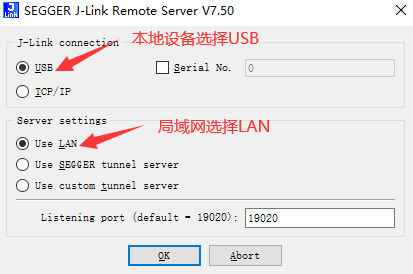
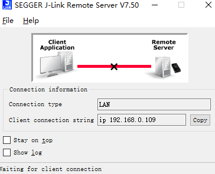
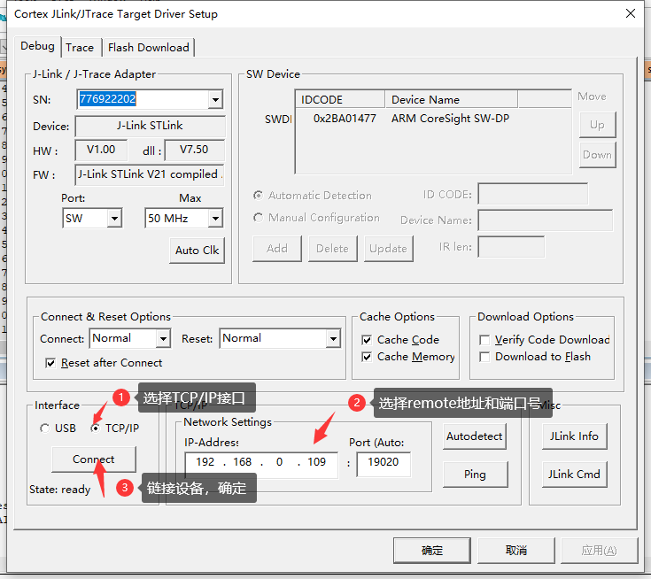

## KEIL远程调试JLINK设备

设备在公司，回家要带来带去比较麻烦怎么办？

如果想要测试某个开发板，手边没有开发板，但是朋友那边有，但是又不想打扰朋友使用电脑怎么办呢？

相信大家可能会说，用qemu等来仿真模拟，但是仿真模拟存在一定的缺陷，有些硬件可能无法模拟，这个时候想借朋友的板子测一下，怎么办呢？


这篇文章教大家如何远程调试JLINK 开发板。

首先你需要有JLINK+ 一款MCU，如果手上有ST-LINK或者NUCLEO板子，也可以把ST-LINK转成JLINK来测试使用（效果和JLINK一模一样）

## 原理讲解

根据官网，我们先看下下面这张图，大概意思就是如果采用局域网的方式，两台笔记本需要在同一个局域网内（就是IP可以相互访问）


另外一种方式是隧道方式，这种主要是由于没有公网IP，采用JLINK服务器隧道的方式进行相互链接，不过这种方式我发现有个缺点，就是remote IP地址未知，不能准确知道IP地址，就不能很完美的使用KEIL，只能用JLINK命令行。


## 环境搭建

首先你需要有两台电脑，确保两台电脑可以相互ping通和建立TCP/IP链接，这个时候就要把两边的防火墙关掉了，确保可以相互ping通和网络环境可以相互建立链接，这个可以百度看下如何关闭WIN10防火墙。

### remote 机器

我们可以先在局域网里面两台计算机测试，假设remote 计算机IP地址是192.168.0.109。

这边需要remote机器上安装`jlink software` 官方软件，然后执行exe `J-Link Remote Server `

选择如下配置，端口号要记住19020



点击OK之后你可以看到



我们只要记住IP地址192.168.0.109 还有端口号19020即可。这个时候remote端就已经设置好了。

###  local端

local端就是我们的自己家里使用的PC，这个时候我们就像平时开发STM32一样，我们打开KEIL。配置很简单

如下图所示：




然后我们就可以像开发板在本地一样，进行开发自己的开发板。

## 测试

程序烧完之后，会发现，我们通常用的串口无法远程过来，那怎么办呢？

这个时候，我们就可以用SEGGER 自带的工具RTT来使用finsh或者等其他的打印方式来进行一个交互和log打印。

这边推荐软件包SEGGER_TOOL      https://github.com/supperthomas/RTTHREAD_SEGGER_TOOL

SWO也是可以进行调试的

如果你对jlink命令行的方式比较熟悉的话。也可以用命令行进行烧入和调试，这边我摘抄一些command常用命令

```
  usb--------连接目标板
  r----------重启目标板
  halt-------停止cpu运行的程序
  loadbin----加载可执行的二进制文件
  g----------跳到代码段地址执行
  s----------单步执行（调试用）
  setpc-----设置pc寄存器的值（调试用）
  setbp-----设置断点
  Regs-------读寄存器组织，该命令会把所有的寄存器显示出来
  wreg-------写寄存器
  mem--------读内存
  w4---------写内存
  power off mmu---关闭mmu，这个对于裸板调试很重要
  w4 cpsr,0x0000001f------切换到系统模式
  speed------设置jtag的传输速率
  rce 0,c0,c0,0-----设置cp15寄存器的第1个寄存器为0
```

如果想要reset开发板，可以用命令`r` + `g` 来实现重启加载命令

## 总结

上面的实验是基于局域网的方式，其实局域网只能很小的范围，所以如果想真正实现远程办公的话，还需要内网穿刺的方式将remote机器使用固定公网IP地址。具体如何内网穿刺可以自行百度frp等方式。这边我就不做过多介绍。不过这种方式如果能够实现，对于一些自动化集成测试，或者设备共享，有一些参考。无用的小知识，增加一点点，简单玩了玩。

像IAR, SEGGER STUDIO, RT-STUDIO, IAR, eclipse等编译器都可以根据相同的原理实现。

不过这种方式如果remote设备比较多的话，就只能根据JLINK的SN号来区分了

这种方法如果有一台服务器连着好几个开发板，提供一个公网IP，然后将JLINK SN号和开发板对应起来，小伙伴们就可以拿来测试自己的程序了。

## 参考文档链接：

JLINK 官方文档：

https://www.segger.com/products/debug-probes/j-link/tools/j-link-remote-server/

ARM KEIL 文档：

https://developer.arm.com/documentation/ka003921/latest

IAR 如何远程调试：

https://wiki.segger.com/IAR_EWARM#Connecting_to_J-Link_via_J-Link_Remote_Server

## 公众号


