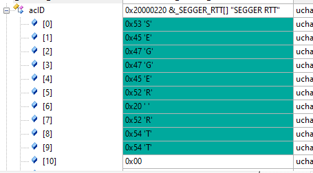
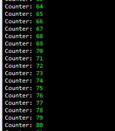
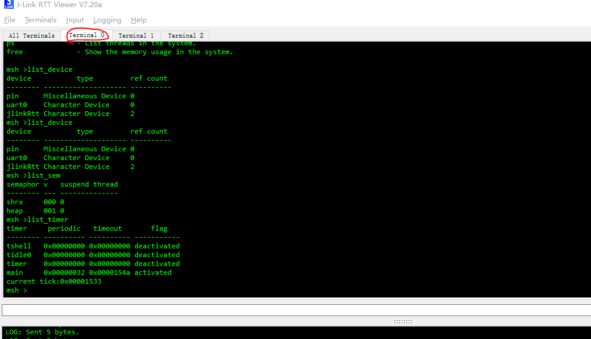

# Segger RTT


## 问题一

SEGGER_RTT  如何固定地址，

不支持自动获取地址（原因未知）

RTT实现代码在RAM中的控制块上每通道使用〜500字节的ROM和24字节的ID + 24字节。每个通道都需要一些内存用于缓冲区。根据输入/输出的负载，建议的大小对于上行通道为1 kByte，对于下行通道为16到32 Byte。


[RTT - SEGGER Wiki](https://wiki.segger.com/RTT)

MDK-ARM specifics:
https://wiki.segger.com/Keil_MDK-ARM#RTT_in_uVision


##  SEGGER RTT putty

依赖条件JLINK，必须要JLINK支持的设备，并且通过JLINK连接的设备。

要通过RTT进行通信，可以使用任何J-Link。通过终端（通道0）进行通信的简单方法是，当与J-Link的连接（例如，通过调试会话）处于活动状态时，使用Telnet客户端或类似客户端创建与localhost：19021的连接。

## J-Link RTT查看器

J-Link RTT Viewer是主要的Windows GUI应用程序，可在调试主机上使用RTT的所有功能。
RTT Viewer可以独立使用，可以打开自己的J-Link和目标连接，也可以与正在运行的调试会话并行，附加到它并使用此现有的J-Link连接。
RTT Viewer支持RTT的所有主要功能：

- 通道0上的端子输出
- 将文本输入发送到通道0
- 最多16个虚拟终端，只有一个目标通道
- 控制文本输出：彩色文本，删除控制台
- 在通道1上记录数据

J-Link RTT Viewer是J-Link软件和文档包的一部分，可免费获得。


## J-Link RTT客户端

J-Link RTT客户端充当Telnet客户端，但是在调试会话关闭时会自动尝试重新连接到J-Link连接。J-Link RTT客户端是Windows，Linux和macOS的J-Link软件和文档包的一部分，可用于简单的RTT用例。


## J-Link RTT记录器

使用J-Link RTT记录器，可以读取上行通道1中的数据并将其记录到文件中。
例如，此通道可用于将性能分析数据发送到主机。J-Link RTT记录器打开了与J-Link的专用连接，可以单独使用，而无需运行调试器。
该应用程序是Windows，Linux和OS X的J-Link软件和文档包
的一部分。J-Link RTT Logger的源代码可以用作将RTT集成到其他PC应用程序（例如调试器）的起点，并且是其中的一部分。 J-Link SDK。


SEGGER RTT实现是用ANSI C编写的，并且可以使用该代码集成到任何嵌入式应用程序中，这些代码可从下面下载。

可以通过简单易用的API使用RTT。甚至有可能重写标准的printf（）函数以使用RTT。使用RTT可以将printf（）花费的时间减至最少，并允许在应用程序执行时间紧迫的实时任务时将调试信息打印到主机PC。

SEGGER RTT实现包括printf（）的简单实现，可用于通过RTT写入格式化的字符串。SEGGER_RTT_Printf（）比大多数标准库printf实现要小，并且不需要堆，并且只需要可配置的堆栈量。

SEGGER RTT实施完全可以使用预处理程序定义进行配置。可以使用Lock（）和Unlock（）例程使读取和写入任务安全，可以轻松设置缓冲区的数量以及终端缓冲区的大小。


### API函数

|            功能名称             |                            描述                             |
| :-----------------------------: | :---------------------------------------------------------: |
|       SEGGER_RTT_Read（）       |                   从输入缓冲区读取数据。                    |
|      SEGGER_RTT_Write（）       |                   将数据写入输出缓冲区。                    |
|   SEGGER_RTT_WriteString（）    |             将以零结尾的字符串写入输出缓冲区。              |
|      SEGGER_RTT_printf（）      |              将格式化的字符串写入输出缓冲区。               |
|      SEGGER_RTT_GetKey（）      |                 从输入缓冲区0获取一个字符。                 |
|      SEGGER_RTT_HasKey（）      |                检查输入缓冲区0中是否有字符。                |
|     SEGGER_RTT_WaitKey（）      |            等待字符在输入缓冲区0中可用并获得它。            |
|  SEGGER_RTT_ConfigUpBuffer（）  |                  配置向上（输出）缓冲区。                   |
| SEGGER_RTT_ConfigDownBuffer（） |                  配置向下（输入）缓冲区。                   |
|       SEGGER_RTT_Init（）       |           仅使用RAM目标时，初始化RTT控制块结构。            |
|   SEGGER_RTT_SetTerminal（）    | 设置“虚拟”终端以用于通过Write和WriteString在通道0上的输出。 |
|   SEGGER_RTT_TerminalOut（）    |            通过“虚拟”终端发送以零结尾的字符串。             |


## 使用颜色输出文本

通过RTT读取的所有数据都像从目标读取的一样被刷新，而无需进行任何修改。
这允许应用程序处理ANSI控制序列，该应用程序打印RTT数据以粗体显示数据或更改其颜色。Linux控制台本身支持在终端应用程序中处理ANSI控制序列。
在Windows上，需要像ANSICON（[http://adoxa.altervista.org/ansicon](http://adoxa.altervista.org/ansicon/)）这样的包装器应用程序，并且可以将其用于调用RTT客户端。某些Telnet应用程序（例如PuTTY）也支持Windows上的ANSI控制序列。


TODO LIST:

- SWO
- MDK 逻辑分析仪  [MDK逻辑分析仪使用注意事项总结,含MDK4.XX和MDK5.XX - STM32开发环境 - 硬汉嵌入式论坛 - Powered by Discuz! (armbbs.cn)](http://www.armbbs.cn/forum.php?mod=viewthread&tid=18097)
- SEGGER_RTT_Syscalls_KEIL.c 如何使用
- 

RT_USING_SEGGER_RTT


menuconfig中选择加载设备jlinkRtt


JTAG 接口和 SWD 接口区别
下图分别是 20pin 的标准 JTAG 引脚和 SWD（ Serial Wire Debug） 引脚， 一般 SWD 接口仅需要 Vref，
SWDIO， SWCLK， RESET 和 GND 五个引脚即可， SWO（Serial Wire Output） 引脚是可选的。 有了 SWO
引脚才可以实现数据从芯片到电脑端的发送。  


# 函数说明

## SEGGER_RTT_Init()  

初始化RTT时钟


## SEGGER_RTT_printf

```
/*********************************************************************
*
*       SEGGER_RTT_printf
*
*  Function description
*    Stores a formatted string in SEGGER RTT control block.
*    This data is read by the host.
*
*  Parameters
*    BufferIndex  Index of "Up"-buffer to be used. (e.g. 0 for "Terminal")
*    sFormat      Pointer to format string, followed by the arguments for conversion
*
*  Return values
*    >= 0:  Number of bytes which have been stored in the "Up"-buffer.
*     < 0:  Error
*
*  Notes
*    (1) Conversion specifications have following syntax:
*          %[flags][FieldWidth][.Precision]ConversionSpecifier
*    (2) Supported flags:
*          -: Left justify within the field width
*          +: Always print sign extension for signed conversions
*          0: Pad with 0 instead of spaces. Ignored when using '-'-flag or precision
*        Supported conversion specifiers:
*          c: Print the argument as one char
*          d: Print the argument as a signed integer
*          u: Print the argument as an unsigned integer
*          x: Print the argument as an hexadecimal integer
*          s: Print the string pointed to by the argument
*          p: Print the argument as an 8-digit hexadecimal integer. (Argument shall be a pointer to void.)
*/
int SEGGER_RTT_printf(unsigned BufferIndex, const char * sFormat, ...) {

```

BufferIndex 是buffer序号

##  SEGGER_RTT_HasKey

检查是否有输入数据

## SEGGER_RTT_GetKey

获取输入的数据值

## SEGGER_RTT_WaitKey

int SEGGER_RTT_WaitKey(void) {
  int r;

  do {
    r = SEGGER_RTT_GetKey();
  } while (r < 0);
  return r;
}


##  SEGGER_RTT_Read  

从buffer里面读数据

Syntax
unsigned SEGGER_RTT_Read (unsigned BufferIndex, char* pBuffer, unsigned
BufferSize);

| Parameter   | Meaning                                                     |
| ----------- | ----------------------------------------------------------- |
| BufferIndex | Index of the down channel to read from.                     |
| pBuffer     | Pointer to a character buffer to store the read characters. |
| BufferSize  | Number of bytes available in the buffer                     |

## SEGGER_RTT_SetTerminal

设置虚拟的terminal

.
Syntax
void SEGGER_RTT_SetTerminal(char TerminalId);

| Parameter  | Meaning                           |
| ---------- | --------------------------------- |
| TerminalId | Id of the virtual terminal (0-9). |

Example
//
// Send a string to terminal 1 which is used as error out.
//
SEGGER_RTT_SetTerminal(1); // Select terminal 1
SEGGER_RTT_WriteString(0, "ERROR: Buffer overflow");
SEGGER_RTT_SetTerminal(0); // Reset to standard terminal  


##  设置buffer

### 设置上行buffer

Configure or add an up buffer by specifying its name, size and flags.
Syntax
int SEGGER_RTT_ConfigUpBuffer (unsigned BufferIndex, const char* sName, char*
pBuffer, int BufferSize, int Flags);

| Parameter   | Meaning                                                      |
| ----------- | ------------------------------------------------------------ |
| BufferIndex | Index of the buffer to configure. Must be lower than SEGGER_RTT_MAX_NUM_UP_CHANNELS. |
| sName       | Pointer to a 0-terminated string to be displayed as the name of the channel. |
| pBuffer     | Pointer to a buffer used by the channel.                     |
| BufferSize  | Size of the buffer in Bytes.                                 |
| Flags       | Flags of the channel (blocking or non-blocking).             |

Return value

| Value | Meaning |
| ----- | ------- |
| ≥ 0   | O.K.    |
| < 0   | Error   |

Example
//
// Configure up buffer 1 to work in blocking mode
//
SEGGER_RTT_ConfigUpBuffer(1, "DataOut", &abDataOut[0], sizeof(abDataOut),
SEGGER_RTT_MODE_BLOCK_IF_FIFO_FULL);
Additional informati


###  设置下行buffer

Configure or add a down buffer by specifying its name, size and flags.
Syntax
int SEGGER_RTT_ConfigDownBuffer (unsigned BufferIndex, const char* sName,
char* pBuffer, int BufferSize, int Flags);

| Parameter   | Meaning                                                      |
| ----------- | ------------------------------------------------------------ |
| BufferIndex | Index of the buffer to configure. Must be lower than SEGGER_RTT_MAX_NUM_DOWN_CHANNELS. |
| sName       | Pointer to a 0-terminated string to be displayed as the name of the channel. |
| pBuffer     | Pointer to a buffer used by the channel.                     |
| BufferSize  | Size of the buffer in Bytes.                                 |
| Flags       | Flags of the channel (blocking or non-blocking).             |

J-Link / J-Trace (UM08001) © 2004-2019 SEGGER Microcontroller GmbH
335 CHAPTER 16 Implementation
Return value

| Value | Meaning |
| ----- | ------- |
| ≥ 0   | O.K.    |
| < 0   | Error   |

Example
//
// Configure down buffer 1
//
SEGGER_RTT_ConfigDownBuffer(1, "DataIn", &abDataIn[0], sizeof(abDataIn),
SEGGER_RTT_MODE_NO_BLOCK_SKIP);
Additional information
Once a buffer is configured only the flags of the buffer should be chang


```
//
// Take in and set to correct values for Cortex-A systems with CPU cache
//
//#define SEGGER_RTT_CPU_CACHE_LINE_SIZE            (32)          // Largest cache line size (in bytes) in the current system
//#define SEGGER_RTT_UNCACHED_OFF                   (0xFB000000)  // Address alias where RTT CB and buffers can be accessed uncached
//
// Most common case:
// Up-channel 0: RTT
// Up-channel 1: SystemView
//
#ifndef   SEGGER_RTT_MAX_NUM_UP_BUFFERS
  #define SEGGER_RTT_MAX_NUM_UP_BUFFERS             (3)     // Max. number of up-buffers (T->H) available on this target    (Default: 3)
#endif

#ifndef   SEGGER_RTT_MAX_NUM_DOWN_BUFFERS
  #define SEGGER_RTT_MAX_NUM_DOWN_BUFFERS           (3)     // Max. number of down-buffers (H->T) available on this target  (Default: 3)
#endif

#ifndef   BUFFER_SIZE_UP
  #define BUFFER_SIZE_UP                            (1024)  // Size of the buffer for terminal output of target, up to host (Default: 1k)
#endif

#ifndef   BUFFER_SIZE_DOWN
  #define BUFFER_SIZE_DOWN                          (16)    // Size of the buffer for terminal input to target from host (Usually keyboard input) (Default: 16)
#endif

#ifndef   SEGGER_RTT_PRINTF_BUFFER_SIZE
  #define SEGGER_RTT_PRINTF_BUFFER_SIZE             (1024u)    // Size of buffer for RTT printf to bulk-send chars via RTT     (Default: 64)
#endif

```


1024 是printf的buffer大小：

```
*/
int SEGGER_RTT_vprintf(unsigned BufferIndex, const char * sFormat, va_list * pParamList) {
  char c;
  SEGGER_RTT_PRINTF_DESC BufferDesc;
  int v;
  unsigned NumDigits;
  unsigned FormatFlags;
  unsigned FieldWidth;
  char acBuffer[SEGGER_RTT_PRINTF_BUFFER_SIZE];

  BufferDesc.pBuffer        =
```


#  Terminal

```
static unsigned char _aTerminalId[16] = { '0', '1', '2', '3', '4', '5', '6', '7', '8', '9', 'A', 'B', 'C', 'D', 'E', 'F' };
```

定义了16个通道

# SEGGER_RTT 结构体

```
typedef struct {
  char                    acID[16];                                 // Initialized to "SEGGER RTT"
  int                     MaxNumUpBuffers;                          // Initialized to SEGGER_RTT_MAX_NUM_UP_BUFFERS (type. 2)
  int                     MaxNumDownBuffers;                        // Initialized to SEGGER_RTT_MAX_NUM_DOWN_BUFFERS (type. 2)
  SEGGER_RTT_BUFFER_UP    aUp[SEGGER_RTT_MAX_NUM_UP_BUFFERS];       // Up buffers, transferring information up from target via debug probe to host
  SEGGER_RTT_BUFFER_DOWN  aDown[SEGGER_RTT_MAX_NUM_DOWN_BUFFERS];   // Down buffers, transferring information down from host via debug probe to target
#if SEGGER_RTT__CB_PADDING
  unsigned char           aDummy[SEGGER_RTT__CB_PADDING];
#endif
} SEGGER_RTT_CB;
```





# 地址问题

https://www.cnblogs.com/chen0207/p/12641055.html

RTT控制块的位置

因为RTTViewer在内存中扫描控制块时，其默认扫描的地址范围可能与芯片的实际内存空间不一致，所以最好定义SEGGER_RTT_SECTION，并且修改连接脚本，

将_SEGGER_RTT变量放置到默认的扫描空间内，这样可有效避免打开RTTViewer，却没有任何打印信息的问题

IAR下的配置如下截图， gcc工具链下操作类似，MDK的连接脚本的语法没研究过~~~

​	_SEGGER_RTT 这个地址一定要打印出来

可以直接search地址

```
0x20000000 0x1000
```

## keil 添加固定地址

加宏定义

```
SEGGER_RTT_SECTION="JLINKRTT"
```


```
SEGGER_RTT_PUT_CB_SECTION(SEGGER_RTT_CB_ALIGN(SEGGER_RTT_CB _SEGGER_RTT))__attribute__((section(".ARM.__at_0x20000000")));
```


# 打印颜色问题：

```
SEGGER_RTT_printf(0, "%sCounter: %s%d\n",
RTT_CTRL_TEXT_BRIGHT_WHITE,
RTT_CTRL_TEXT_BRIGHT_GREEN,
count);
```

打印出来的效果




## segger_rtt 回显

已经有回显功能

不需要额外添加


输入的时候，一定要回车才能输入数据


## 输入数据最多是16byte

BUFFER_SIZE_DOWN 这个参数是16bye可以修改

如果需要扩大输入大小的时候，可以修改这个值





#define RT_CONSOLE_DEVICE_NAME "jlinkRtt"
#define RT_USING_SEGGER_RTT


## 修改内容：

SEGGER_RTT.c

```
#if defined(__CC_ARM) || defined(__CLANG_ARM)           /* ARM Compiler */
SEGGER_RTT_PUT_CB_SECTION(SEGGER_RTT_CB_ALIGN(SEGGER_RTT_CB _SEGGER_RTT))__attribute__((section(".ARM.__at_0x20000000")));
SEGGER_RTT_PUT_BUFFER_SECTION(SEGGER_RTT_BUFFER_ALIGN(static char _acUpBuffer  [SEGGER_RTT__ROUND_UP_2_CACHE_LINE_SIZE(BUFFER_SIZE_UP)]));
SEGGER_RTT_PUT_BUFFER_SECTION(SEGGER_RTT_BUFFER_ALIGN(static char _acDownBuffer[SEGGER_RTT__ROUND_UP_2_CACHE_LINE_SIZE(BUFFER_SIZE_DOWN)]));
#else
SEGGER_RTT_PUT_CB_SECTION(SEGGER_RTT_CB_ALIGN(SEGGER_RTT_CB _SEGGER_RTT));
SEGGER_RTT_PUT_BUFFER_SECTION(SEGGER_RTT_BUFFER_ALIGN(static char _acUpBuffer  [SEGGER_RTT__ROUND_UP_2_CACHE_LINE_SIZE(BUFFER_SIZE_UP)]));
SEGGER_RTT_PUT_BUFFER_SECTION(SEGGER_RTT_BUFFER_ALIGN(static char _acDownBuffer[SEGGER_RTT__ROUND_UP_2_CACHE_LINE_SIZE(BUFFER_SIZE_DOWN)]));
#endif

```


# 参考链接

- 使用J-Link命令行烧写芯片内部Flash

https://mp.weixin.qq.com/s/fgIa3JkFoguWjVQkIBp-ZQ

- 浅谈嵌入式MCU软件开发之SEGGER实时传输(RTT)的移植和printf()重定向应用(附S32K144移植工程)

https://mp.weixin.qq.com/s/-yN3ZtY9cWWtHPniSXIboQ

- 高性能的J-Link RTT通讯，不妨来了解一下！

https://mp.weixin.qq.com/s/wmY4Nx9zvVJ0WywDwP2aag

- SWO

https://mcuxpresso.nxp.com/api_doc/dev/210/group__Semihosting.html

- SWO 高级用法

https://youtu.be/-B6QjdnMzmY

- IAR 调试技巧

https://www.iar.com/knowledge/learn/debugging/
