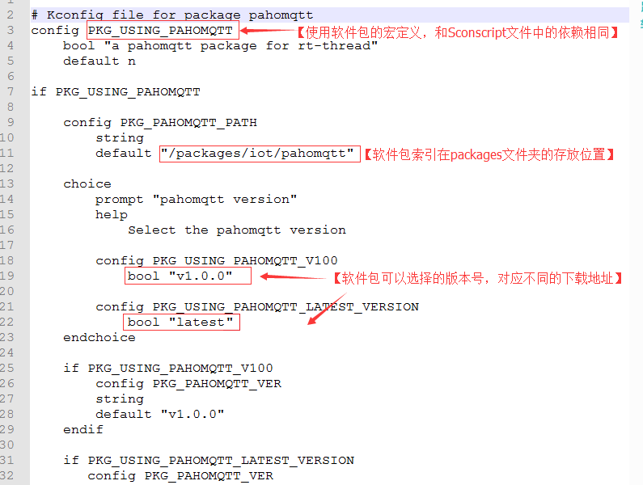

# 软件包制作小计

之前写了一份制作指南，可以先看这个[rtthread 软件包制作](https://blog.csdn.net/lt6210925/article/details/105176863?spm=1001.2014.3001.5501)

本文记录一些软件包的小笔记，方便后续增加软件包，或者管理软件包

首先找到RTTHREAD官方的关于软件包制作相关的文章，研读一遍，在代码贡献篇的[软件包开发指南](https://www.rt-thread.org/document/site/development-guide/package/package/)。

在官方的packag里面要添加Kconfig和package.json

在自己的软件包里面需要添加Sconscript

建议

- 讲Kconfig放到软件包中备份，方便后续恢复到特定版本。

## Kconfig

不懂的先研读一下RTTHREAD文档的[kconfig](https://docs.rt-thread.org/#/development-tools/kconfig/kconfig)相关的内容，

这边要补充的是一些特殊的特殊用法

首先软件包中的需要一个宏定义：



这里25行有个比较重要的就是，如果添加版本号，不仅在choice里面添加版本号

还要在最下面添加一个PKG_PAHOMQTT_VER相对应的宏

写法可以类似于下面的写法

```
    config PKG_NRF5X_SDK_VER
       string
       default "v13.0.0"    if PKG_USING_NRF5X_SDK_V1300
       default "v16.0.0"    if PKG_USING_NRF5X_SDK_V1600
       default "v16.1.0"    if PKG_USING_NRF5X_SDK_V1610
       default "latest"    if PKG_USING_NRF5X_SDK_LATEST_VERSION

```

PKG_NRF5X_SDK_VER这个宏比较重要。

会和package.json里面的version相对应。

RTTHREAD脚本里面有些特殊处理。

这个default可以让一个配置有多种defalt值，这个可以用在不同的开发板上。

- select 的内容只能是bool型，不能是int型` select BUFSIZE=10` 像这种写法是非法的。
- 可以多用depends on 代替if

参考资料

https://www.kernel.org/doc/Documentation/kbuild/kconfig-language.txt

## package.json

这里面需要注意的是发布版本的时候

```
    {
      "version": "v1.0.0",
      "URL": "https://github.com/wuhanstudio/elapack.git",
      "filename": "elapack-1.0.0.zip",
      "VER_SHA": "0f6c51f2607f74d2940c18db7fa2b286533c6b4a"
    },
```

这里的URL可以默认就是你的软件包的地址不用修改，VER_SHA要和你的tag版本的HASH值对应

具体看下面[如何release版本](#如何release版本)

这里的version要和上面的Kconfig中对应

## Sconscript

[文档中心Sconscript 示例](https://docs.rt-thread.org/#/development-tools/scons/scons?id=sconscript-%e7%a4%ba%e4%be%8b)

[Scons官方文档](https://scons.org/documentation.html)

需要提醒的是

对于group，如下所示

```
group = DefineGroup('ABC', src, depend = [''], LIBS = LIBS, LIBPATH=LIBPATH)

Return('group')

```

如果想要有多个group，可以参考如下写法：

```
group = DefineGroup('ABC', src, depend = [''], LIBS = LIBS, LIBPATH=LIBPATH)
group += DefineGroup('DEF', def_src, depend = [''], LIBS = LIBS, LIBPATH=LIBPATH)
Return('group')


```


## submodule

[参考文章](https://club.rt-thread.org/ask/article/2689.html)


添加指定submodule

```console
git submodule add https://github.com/NordicSemiconductor/nrfx.git <local path>
```

这个命令可以添加submodule

-b branch可以指定特定branch


查看submodule：

```
git submodule
```


删除submodule

首先，需要删除 `.git/config` 和 `.gitsubmodle` 文件里submodule相关的部分，然后执行：

```
git rm --cached <local path>
```


git clone <repository> --recursive  //递归的方式克隆整个项目
git submodule add <repository> <path> //添加子模块
git submodule init //初始化子模块
git submodule update //更新子模块
git submodule foreach git pull  //拉取所有子模块

https://blog.csdn.net/wkyseo/article/details/81589477


你当时拉的submodule的时候的commit，后面都会以该commit来处理，及时submodule的那边代码有所更新，也不会影响到该submodule的代码。这样也是submodule的一个好处。


如果单独使用的话，拉取submodule的代码：

```
git submodule init //初始化子模块
git submodule update //更新子模块
```


更新子模块到最新的代码: 先进入子模块，然后切换到需要的分支，这里是master分支，然后对子模块pull，这种方法会改变子模块的分支

这里也可以checkout到某次commit提交

```
cd project3/moduleA
git checkout master
```

更新完没啥问题，可以直接commit该文件夹提交即可。


## 软件包如何release版本

本节主要讲解如何release软件包中的版本号

### github发布tag和release

先在软件包中新建一个tag

```
git tag v1.0.0
```

把tag上传到github上

```
git push origin v1.0.0
```

在github上点击release


找到该tag的commit的hash值类似于`4c61f272d8532ce89801be503360afd5bc62d7b3`

拷贝该tag的连接地址：

例如：

```
https://github.com/supperthomas/RTT_PACKAGE_BTSTACK/archive/refs/tags/v1.0.0.zip
```

(官方建议用zip连接地址，这样在git提交代码的时候不会相互影响，package包只是源文件)

这个比较重要

### 修改env软件包中的信息

- Kconfig

  Kconfig中要添加一个类似的信息，注意，需要添加两个地方

  

- package.json

  添加如下版本信息，注意这里的VER_SHA不需要填，url选择对应的zip下载链接即可

```
    {
      "version": "v1.10",
      "URL": "https://github.com/RT-Thread-packages/micropython/archive/1.10.zip",
      "filename": "micropython-1.10.zip",
      "VER_SHA": ""
    },
```

### 提交Kconfig和package.json到github

测试完成之后将修改的Konfig和package.json提交到github

### 后续开发

后续开发直接在branch上面开发即可，等到release版本的时候，将branch merge到master主分支上，再参考上述操作再执行一次

### 软件包制作建议

 - 默认官方的RT-THREAD package中的版本号默认使用最新的稳定的版本，而不是latest版本（方便后续更新）
    
 - 每次Kconfig如果改动比较大的话，一定要加个版本NUM来区分一下
 
 ```
if PKG_BTSTACK_VER_NUM >= 0x10000
endif
    
    config PKG_BTSTACK_VER_NUM
        hex
        default 0x99999    if PKG_USING_BTSTACK_LATEST_VERSION
        default 0x10000    if PKG_USING_BTSTACK_V100
        default 0x00001    if PKG_USING_BTSTACK_V001
 ```
    
    
 - 建议每次将Kconfig和版本号一起打包，放到软件包下面

 - 建议新功能在branch上修改
    
 - release 版本如果有bug，修改tag，
