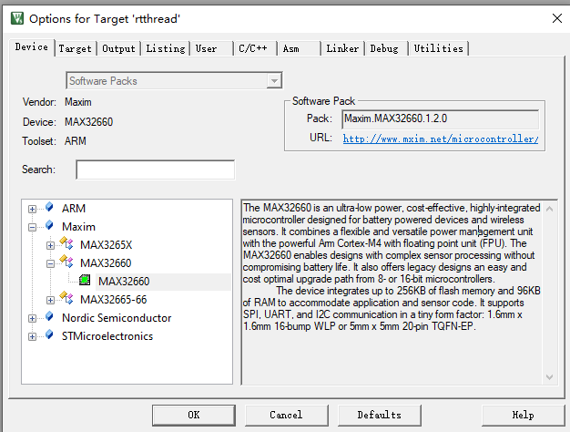
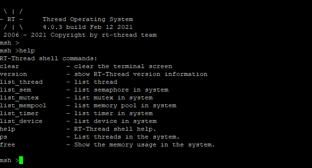

# RTTHREAD移植新的BSP开发板

## 简介

你是否有一款新的开发板，RTTHREAD  [Master](https://github.com/RT-Thread/rt-thread)分支上还没有支持？

这篇文章简单介绍一下如何想要一款新的开发板或者芯片支持RTTHREAD

一般有三种难度

- 场景一，如果你的开发板上的MCU，已经有类似的板子已经支持好了，比如STM32系列，可以参考[STM32 BSP制作](https://github.com/RT-Thread/rt-thread/blob/master/bsp/stm32/docs/STM32%E7%B3%BB%E5%88%97BSP%E5%88%B6%E4%BD%9C%E6%95%99%E7%A8%8B.md)
- 场景二，如果你的开发板上面的MCU 并没有相关的支持，但是内核和指令集有相应的支持，这个难度也还可以，这种场景是本文讲的主要内容，这种比如MCU都是ARM架构的，内核是M4的，像这类MCU 也是比较方便移植，当然记录这篇文章也是方便后续其他人移植。因为这类芯片汇编代码等都移植好了，所以移植起来相对来说比较方便，但是又不是特别简单，所以这篇文章记录一下。
- 场景三， 你的开发板上的MCU，即没有相关的内核，也没有对应的汇编文件，这种就难度比较大了。这边这次不做介绍，下次有机会接触对应的芯片的时候，介绍

## 移植前准备

本文场景是一颗内核架构已经在RTTHREAD上面支持了，例如MAX32660,这是一颗ARM-M4F的内核，但是这颗芯片RTTHREAD上还没有支持起来。

首先你得先具备熟悉以下两方面，芯片方面和RTTHREAD方面

###  芯片方面

我们得先熟悉当前芯片的官方服务例程如何跑的，找到具体的sample和一些网上的资料，分以下一些方面

- 官方服务例程，这边MAX是eclipse，熟悉eclipse
- keil pack 里面的服务例程，这个往往大家会忽略，其实有些厂商支持keil pack装好之后里面都有一些服务例程，熟悉keil的朋友用起来会比较方便。[网址](https://www.keil.com/dd2/Pack/)
- 对于移植主要了解以下几个例程，Systick(其他定时器也可以，了解一款)，UART(console需要)， GPIO(点亮小灯需要) ，初期把整个框架搭起来，console可以使用，了解这几个例程就可以了，


### RTTHREAD方面

rtthread方面有以下文档需要熟悉 

首先你要对RTTHREAD用法比较熟悉一些，

官方文档地址：[RTTHREAD文档中心](https://www.rt-thread.org/document/site/)

RTTHREAD支持的最好的是STM32系列，如果你有一款STM32的开发板，可以先跑一下熟悉一下。

和本文相关的一些文档下面我先列出来：

- [Keil 模拟器 STM32F103 上手指南](https://www.rt-thread.org/document/site/tutorial/quick-start/stm32f103-simulator/stm32f103-simulator/#_3)

- [RT-Thread Nano 移植原理](https://www.rt-thread.org/document/site/tutorial/nano/nano-port-principle/an0044-nano-port-principle/#startups)

- [移植 RT-Thread Nano 到 RISC-V](https://www.rt-thread.org/document/site/tutorial/nano/nano-port-gcc-riscv/an0042-nano-port-gcc-riscv/#starts)

- [基于 Keil MDK 移植 RT-Thread Nano](https://www.rt-thread.org/document/site/tutorial/nano/nano-port-keil/an0039-nano-port-keil/)

- [RT-Thread 启动流程](https://www.rt-thread.org/document/site/programming-manual/basic/basic/#rt-thread_1)

## 移植步骤

这边我讲下我的移植顺序

### 点亮小灯

官方服务例程里面通常会有GPIO点亮小灯的例程，通常有开GPIO时钟，设置GPIO管脚的功能为输出，然后就可以闪灯了。找到这几步的函数。

### 熟悉Systick例程

熟悉下Systick服务例程，定时器如何定时的触发，这个通常是CMSIS接口设置的，一般是通用的，不排除有些特殊配置，根据官方给的例程来就好了。

### 可以编译通过的bsp

这边可以找STM32F4或者L4系列都可以，拷贝到你需要的文件夹下面

对于keil，可以先改下template.uvprojx 文件，把target改成你对应的开发板



改完之后需要修改rtconfig.h来适应一些配置

这边提供一个最小的rtconfig.h来方便下次配置

```
#ifndef RT_CONFIG_H__
#define RT_CONFIG_H__

/* Automatically generated file; DO NOT EDIT. */
/* RT-Thread Configuration */

/* RT-Thread Kernel */

#define RT_NAME_MAX 8
#define RT_ALIGN_SIZE 4
#define RT_THREAD_PRIORITY_32
#define RT_THREAD_PRIORITY_MAX 32
#define RT_TICK_PER_SECOND 100
#define RT_USING_IDLE_HOOK
#define RT_IDLE_HOOK_LIST_SIZE 4
#define IDLE_THREAD_STACK_SIZE 256
#define RT_USING_TIMER_SOFT
#define RT_TIMER_THREAD_PRIO 4
#define RT_TIMER_THREAD_STACK_SIZE 512

/* Inter-Thread communication */

#define RT_USING_SEMAPHORE
#define RT_USING_MUTEX

/* Memory Management */

#define RT_USING_MEMPOOL
#define RT_USING_SMALL_MEM
#define RT_USING_HEAP

/* Kernel Device Object */

#define RT_USING_DEVICE
#define RT_USING_CONSOLE
#define RT_CONSOLEBUF_SIZE 128
#define RT_CONSOLE_DEVICE_NAME "uart1"
#define RT_VER_NUM 0x40003

/* RT-Thread Components */

#define RT_USING_COMPONENTS_INIT
#define RT_USING_USER_MAIN
#define RT_MAIN_THREAD_STACK_SIZE 2048
#define RT_MAIN_THREAD_PRIORITY 10

/* C++ features */


/* Command shell */

#define RT_USING_FINSH
#define FINSH_THREAD_NAME "tshell"
#define FINSH_USING_HISTORY
#define FINSH_HISTORY_LINES 5
#define FINSH_USING_SYMTAB
#define FINSH_USING_DESCRIPTION
#define FINSH_THREAD_PRIORITY 20
#define FINSH_THREAD_STACK_SIZE 4096
#define FINSH_CMD_SIZE 80
#define FINSH_USING_MSH
#define FINSH_USING_MSH_DEFAULT
#define FINSH_USING_MSH_ONLY
#define FINSH_ARG_MAX 10

/* Device virtual file system */


/* Device Drivers */

#define RT_USING_DEVICE_IPC
#define RT_PIPE_BUFSZ 512
#define RT_USING_SERIAL
#define RT_SERIAL_USING_DMA
#define RT_SERIAL_RB_BUFSZ 64


#define SOC_MAX32660
#define SOC_MAXIM

/* On-chip Peripheral Drivers */

#define BSP_USING_UART
#define BSP_USING_UART1

#endif

```

最后两个是需要手动添加的，后面可以手动添加。


`scons --target=mdk5`，然后打开project, 删除所有的和芯片相关的内容，保留RTTHREAD内核相关的内容，编译完成之后，根据GPIO里面的需要的文件，添加到RTTHREAD里面

通常对于ARM CORTEX-M4来讲，需要库里面的两个startup文件即可，

			- system_max32660.c  这个是C语言写的SystemInit函数
			- startup_max32660.s  这个是汇编写的启动函数

这两个文件基本都是不需要修改的。

剩下的就是一个board.c和application.c

application.c

参考demo

```
/*
 * Copyright (c) 2006-2020, RT-Thread Development Team
 *
 * SPDX-License-Identifier: Apache-2.0
 *
 * Change Logs:
 * Date           Author       Notes
 * 2020-04-29     supperthomas first version
 *
 */

#include <rtthread.h>
#include <rtdevice.h>

int main(void)
{
    int count = 1; 
    
    while (count++)
    {    
        rt_thread_mdelay(500);                    
    }
    return RT_EOK;
}
```

board.c 参考demo

```
/*
 * Copyright (c) 2006-2020, RT-Thread Development Team
 *
 * SPDX-License-Identifier: Apache-2.0
 *
 * Change Logs:
 * Date           Author       Notes
 * 2020-04-29     supperthomas first version
 *
 */
#include <rtthread.h>
#include <rthw.h>

#include "board.h"

/**
 * This is the timer interrupt service routine.
 *
 */
void SysTick_Handler(void)
{
    /* enter interrupt */
    rt_interrupt_enter();

    rt_tick_increase();

    /* leave interrupt */
    rt_interrupt_leave();
}

void rt_hw_systick_init(void)
{
    /* enter interrupt */
    rt_interrupt_enter();

    rt_tick_increase();

    /* leave interrupt */
    rt_interrupt_leave();
}


void rt_hw_board_init(void)
{
   // rt_hw_interrupt_enable(0);
    // sd_power_dcdc_mode_set(NRF_POWER_DCDC_ENABLE);
    /* Activate deep sleep mode */

    rt_hw_systick_init();

//#if defined(RT_USING_HEAP)
//    rt_system_heap_init((void *)HEAP_BEGIN, (void *)HEAP_END);
//#endif

//#ifdef RT_USING_SERIAL
//    rt_hw_uart_init();
//#endif

//#ifdef RT_USING_CONSOLE
//    rt_console_set_device(RT_CONSOLE_DEVICE_NAME);
//#endif

#ifdef RT_USING_COMPONENTS_INIT
    rt_components_board_init();
#endif

}
```

board.h参考demo

```
/*
 * Copyright (c) 2006-2020, RT-Thread Development Team
 *
 * SPDX-License-Identifier: Apache-2.0
 *
 * Change Logs:
 * Date           Author       Notes
 * 2020-04-29     supperthomas first version
 */
#ifndef _BOARD_H_
#define _BOARD_H_

#include <rtthread.h>
#include <rthw.h>

#if defined(__CC_ARM) || defined(__CLANG_ARM)
extern int Image$$RW_IRAM1$$ZI$$Limit;
#define HEAP_BEGIN      ((void *)&Image$$RW_IRAM1$$ZI$$Limit)
#elif __ICCARM__
#pragma section="CSTACK"
#define HEAP_BEGIN      (__segment_end("CSTACK"))
#else
extern int __bss_end__;
#define HEAP_BEGIN      ((void *)&__bss_end__)
#endif

#define HEAP_END       (0x20001000)

void rt_hw_board_init(void);

#endif
```

上面3个文件都是可以直接编译通过的，根据GPIO例程，添加对应的一些.c文件即可。

这一步保证编译通过即可。

### 调试systick

systick可以是ARM里面的systick，也可以使用TIMER来代替。

TIMER分两步走，先配置时钟，设置timer的触发tick间隔，然后设置中断服务例程。

这个在官方服务例程中找对应的初始化，放到函数rt_hw_systick_init()中，

这个里面把timer设置成RT_TICK_PER_SECOND即可，这个通常是1000或者100，代表1s， timer起来1000次，1ms一次。

**中断服务例程**

systick有专门的服务例程SysTick_Handler，根据startup_max32660.s的中断向量表来的，其他TIMER可以找到对应的服务例程。

这边demo中已经写好了，只需要调rt_tick_increase函数即可。

这个时候编译通过，通过DEBUG 断点到main里面的while循环，看是否是0.5s触发一次断点即可。

如果这里调通了证明系统起来就快了。

如果这里调不通，需要整理main的入口等关系问题，

### 添加小灯GPIO

这个时候就可以点亮一个小灯来看看了。GPIO点亮小灯根据厂商给的demo来设置。无外乎是初始化GPIO然后翻转GPIO。这个时候可以根据厂商的demo来添加相关的文件，可能要添加库文件

添加到main函数里面，看下效果就好了，这一步编译完成之后，可以看到小灯一闪一闪亮晶晶了。这边基本系统已经跑起来了。

### 添加drv_uart.c

GPIO其实主要方便来看演示效果的，当然rtthread有个非常好的shell系统finsh，这个需要把drv_uart.c support起来就可以用了，当然如果你只用个内核不用finsh的话，也是可以的，但是通常上传到master分支上最好有个finsh功能，方便后面人在你的基础上继续完善其他功能。

这边提供一个可以编译通过的drv_uart.c

```
/*
 * Copyright (c) 2006-2018, RT-Thread Development Team
 *
 * SPDX-License-Identifier: Apache-2.0
 *
 * Change Logs:
 * Date           Author       Notes
 * 2021-02-08     Supperthomas first version
 */

#include "board.h"
#include "uart.h"
#include "rtdevice.h"

#define UART0_CONFIG                                                \
    {                                                               \
        .name = "uart0",                                            \
        .Instance = MXC_UART_GET_UART(0),                           \
        .irq_type = MXC_UART_GET_IRQ(0),                            \
    }

    
#define UART1_CONFIG                                                \
    {                                                               \
        .name = "uart1",                                            \
        .Instance = MXC_UART_GET_UART(1),                           \
        .irq_type = MXC_UART_GET_IRQ(1),                            \
    }

struct mcu_uart_config
{
    const char *name;
    mxc_uart_regs_t *Instance;
    IRQn_Type irq_type;
};

struct mcu_uart
{
    mxc_uart_regs_t handle;
    struct mcu_uart_config *config;

    rt_uint16_t uart_dma_flag;
    struct rt_serial_device serial;
};


#ifdef RT_USING_SERIAL

//#define DRV_DEBUG
//#define LOG_TAG             "drv.usart"
//#include <drv_log.h>

#if !defined(BSP_USING_UART0) && !defined(BSP_USING_UART1)

#error "Please define at least one BSP_USING_UARTx"
/* this driver can be disabled at menuconfig -> RT-Thread Components -> Device Drivers */
#endif

enum
{
#ifdef BSP_USING_UART0
    UART0_INDEX,
#endif
#ifdef BSP_USING_UART1
    UART1_INDEX,
#endif

};

static struct mcu_uart_config uart_config[] =
{
#ifdef BSP_USING_UART0
    UART0_CONFIG,
#endif
#ifdef BSP_USING_UART1
    UART1_CONFIG,
#endif
};

static struct mcu_uart uart_obj[sizeof(uart_config) / sizeof(uart_config[0])] = {0};

static rt_err_t mcu_configure(struct rt_serial_device *serial, struct serial_configure *cfg)
{
    struct mcu_uart *uart;
    RT_ASSERT(serial != RT_NULL);
    RT_ASSERT(cfg != RT_NULL);
    return RT_EOK;
}

static rt_err_t mcu_control(struct rt_serial_device *serial, int cmd, void *arg)
{
    struct mcu_uart *uart;

    RT_ASSERT(serial != RT_NULL);
    uart = rt_container_of(serial, struct mcu_uart, serial);

    switch (cmd)
    {
    /* disable interrupt */
    case RT_DEVICE_CTRL_CLR_INT:
        /* disable rx irq */
        NVIC_DisableIRQ(uart->config->irq_type);
        /* disable interrupt */
        break;

    /* enable interrupt */
    case RT_DEVICE_CTRL_SET_INT:
        /* enable rx irq */
        /* enable interrupt */
        break;

    case RT_DEVICE_CTRL_CLOSE:
        break;

    }
    return RT_EOK;
}

static int mcu_putc(struct rt_serial_device *serial, char c)
{
    struct mcu_uart *uart;
    RT_ASSERT(serial != RT_NULL);

    uart = rt_container_of(serial, struct mcu_uart, serial);

    //uart->handle.Instance->DR = c;

    return 1;
}

static int mcu_getc(struct rt_serial_device *serial)
{
    int ch;
    struct mcu_uart *uart;
    RT_ASSERT(serial != RT_NULL);
    uart = rt_container_of(serial, struct mcu_uart, serial);

    ch = -1;
    //if (__HAL_UART_GET_FLAG(&(uart->handle), UART_FLAG_RXNE) != RESET)
   // {
       // ch = uart->handle.Instance->DR & 0xff;
   // }
    return ch;
}

static const struct rt_uart_ops mcu_uart_ops =
{
    .configure = mcu_configure,
    .control = mcu_control,
    .putc = mcu_putc,
    .getc = mcu_getc,
};

int rt_hw_usart_init(void)
{
    rt_size_t obj_num = sizeof(uart_obj) / sizeof(struct mcu_uart);
    struct serial_configure config = RT_SERIAL_CONFIG_DEFAULT;
    rt_err_t result = 0;

    for (int i = 0; i < obj_num; i++)
    {
        /* init UART object */
        uart_obj[i].config = &uart_config[i];
        uart_obj[i].serial.ops    = &mcu_uart_ops;
        uart_obj[i].serial.config = config;

        /* register UART device */
        result = rt_hw_serial_register(&uart_obj[i].serial, uart_obj[i].config->name,
                                       RT_DEVICE_FLAG_RDWR
                                       | RT_DEVICE_FLAG_INT_RX
                                       | RT_DEVICE_FLAG_INT_TX
                                       | uart_obj[i].uart_dma_flag
                                       , NULL);
        RT_ASSERT(result == RT_EOK);
    }

    return result;
}
//INIT_BOARD_EXPORT(rt_hw_usart_init);
#endif /* RT_USING_SERIAL */
```

这边简单讲解一下这些函数作用，你就大概知道如何支持uart了。

- rt_hw_uart_init

`rt_hw_usart_init` 这个函数在`rt_hw_board_init`里面systick初始化之后会调用

然后调用rt_console_set_device来设置console，这里是通过名称来关联的。

`rt_hw_usart_init` 这个函数并不负责初始化uart串口，只是把下面的uart的所有操作注册进去，

```
static const struct rt_uart_ops mcu_uart_ops =
{
    .configure = mcu_configure,
    .control = mcu_control,
    .putc = mcu_putc,
    .getc = mcu_getc,
};
```

- putc和getc

这个比较好理解，就是你的uart驱动发送一个字节，和接收一个字节

这边通常是读取一个字节和发送一个字节的寄存器即可。这边不会涉及到中断等

- mcu_configure

这个函数主要初始化uart寄存器，设置波特率等一些静态的参数

- mcu_control

这里负责打开中断，开始接受串口数据

- 中断服务例程

中断服务例程需要通知rtthread去掉getc取数据

这边需要知道中断如何清中断，并且掉rt_hw_serial_isr函数来通知来取数据

```
void UART1_IRQHandler(void)
{
    rt_interrupt_enter();

    rt_hw_serial_isr(&(uart_obj[UART1_INDEX].serial), RT_SERIAL_EVENT_RX_IND);

    uint32_t  intst = 0;
    intst = MXC_UART1->int_fl;
    MXC_UART1->int_fl = intst;

    rt_interrupt_leave();
}
```

这边可以先支持putc就是UART TX，先看到串口有数据发出来就可以了。之后比较难的就是UART RX了。

这部分要根据官方例程做一些实验，我这边是要知道UART 的IDLE中断什么时候触发，或者一些其他FIFO满中断如何触发。然后设置对应的寄存器即可。

UART调通之后，会看到串口可以打印响应的信息了



能达到这个效果就不错了，可以做很多事情了。

这边调好一个UART之后，可以试着调另外一个UART。把这个放到对应的.c里面即可或者放到application.c里面即可，我们通过命令来测试下即可，这边需要将UART TX RX两个引脚对连起来。

```
#include <rtthread.h>
// you can connect the uart tx with rx 
#define SAMPLE_UART_NAME       "uart0"      /* ?????? */
#define UART_DATA_TEST_SIZE         10

static struct rt_semaphore rx_sem;
static rt_device_t serial;
static char tx_data[UART_DATA_TEST_SIZE];
static char rx_data[UART_DATA_TEST_SIZE];

static rt_err_t uart_input(rt_device_t dev, rt_size_t size)
{

    rt_sem_release(&rx_sem);

    return RT_EOK;
}

static void serial_thread_entry(void *parameter)
{
    char ch;
    int index=0;

    while (1)
    {

        while (rt_device_read(serial, -1, &ch, 1) != 1)
        {
            rt_sem_take(&rx_sem, RT_WAITING_FOREVER);
        }
        rx_data[index++] = ch;
        rt_kprintf("\r\n transmit data:%x\r\n",ch);
        if(index >=UART_DATA_TEST_SIZE)
        {
            rt_kprintf("\r\n transmit done\r\n");
            index = 0;
            break;
        }
    }
}

static int uart_sample(int argc, char *argv[])
{
    rt_err_t ret = RT_EOK;
    char uart_name[RT_NAME_MAX];

    for(int i = 0;i< UART_DATA_TEST_SIZE;i++)
    {
        tx_data[i] = i;
    }
    if (argc == 2)
    {
        rt_strncpy(uart_name, argv[1], RT_NAME_MAX);
    }
    else
    {
        rt_strncpy(uart_name, SAMPLE_UART_NAME, RT_NAME_MAX);
    }

    serial = rt_device_find(uart_name);
    if (!serial)
    {
        rt_kprintf("find %s failed!\n", uart_name);
        return RT_ERROR;
    }

    rt_sem_init(&rx_sem, "rx_sem", 0, RT_IPC_FLAG_FIFO);
    rt_device_open(serial, RT_DEVICE_FLAG_INT_RX);
    rt_device_set_rx_indicate(serial, uart_input);
    rt_device_write(serial, 0, tx_data, UART_DATA_TEST_SIZE);

    rt_thread_t thread = rt_thread_create("serial", serial_thread_entry, RT_NULL, 1024, 25, 10);

    if (thread != RT_NULL)
    {
        rt_thread_startup(thread);
    }
    else
    {
        ret = RT_ERROR;
    }

    return ret;
}
MSH_CMD_EXPORT(uart_sample, uart device sample);
```

### PR工程

PR工程是个比较浩大的工程，需要了解bsp里面的每一个细节：

这边你可以学一下scons如何使用的来对对应的文件进行修改：[SCons 构建工具](https://www.rt-thread.org/document/site/programming-manual/scons/scons/)

以及Kconfig语法：[Kconfig 语法](https://www.rt-thread.org/document/site/programming-manual/kconfig/kconfig/)

#### Kconfig

Kconfig主要用来生成#define头文件，主要服务于rtconfig.h的，所以如果你之前手动在rtconfig.h里添加的宏定义如果想做的比较好的话，需要在对应的Kconfig里面添加。这个主要看你需要menuconfig在哪个目录下面，通常是bsp目录下面的Kconfig索引到其他的例如board/Kconfig

通常在board/Kconfig里面需要添加一些模块UART和GPIO

主要是改board/Kconfig

#### scons

这个就比较复杂了，耗时也比较多。

首先在你scons的目录下，通常bsp目录下面

- SConstruct

这个文件是用来包含一些其他文件夹中的SConscript的

- SConscript

所有你需要单独包含的文件夹，都需要用SConscript这个文件来索引该目录下面的需要的配置文件，

board下面的SConscript需要重点维护，其他如果官方的HAL库需要对应的文件，也是需要修改的。

- rtconfig.py

这个文件用来修改编译器相关的一些配置，和选项的，这部分比较复杂一些，可以学习一下一些编译选项

- link_scripts

这个文件夹里面主要存放的是link相关的一些配置，比如RAM地址和ROM地址

大概需要修改的就是这些文件，其他可能还有比较多，主要的离不开这几个，有些参数可以放到template里面现行设置，后期等找到合适的方式再继续整理。

### 写下readme.md


