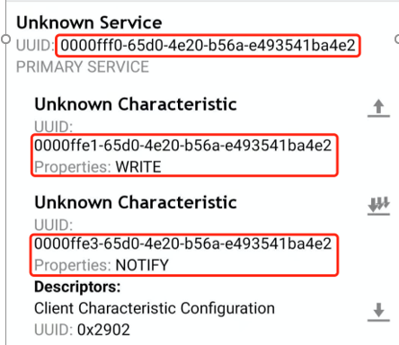
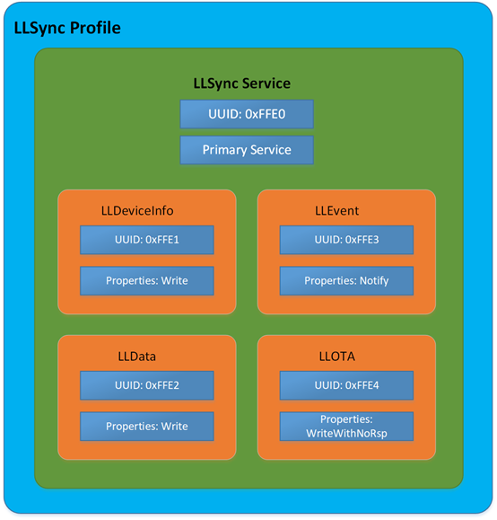
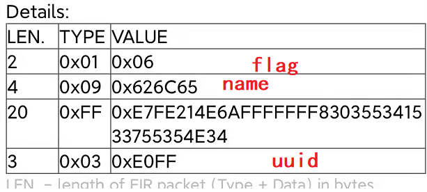
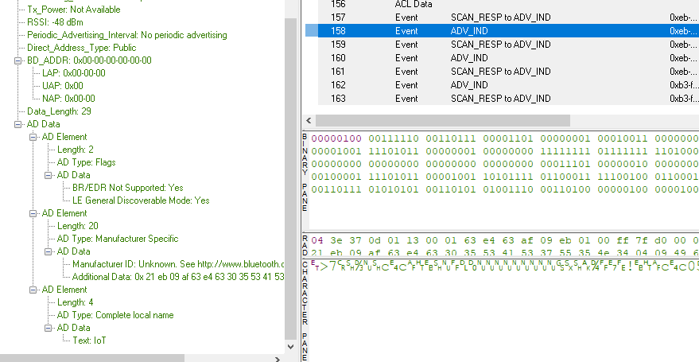
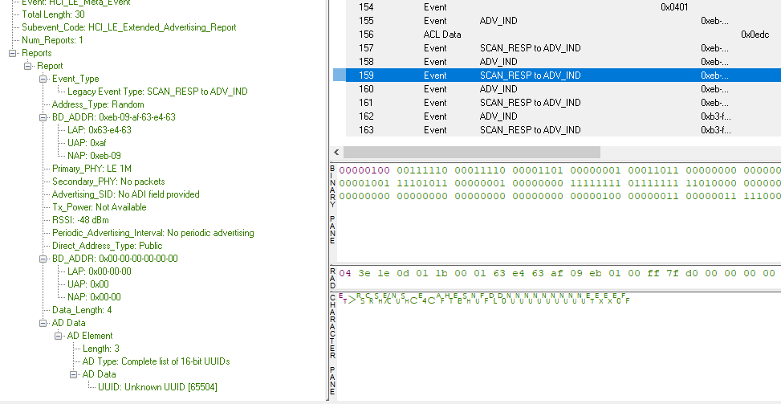

##  文档概要

这篇文章主要介绍llsync SDK的移植到其他协议栈需要理解的部分。属于移植到其他协议栈或者其他芯片的时候，需要做的前期的预习准备工作。理解本文，基本上可以知道新的协议栈如何移植。

## 框架

如果想要移植llsync的话，就要先了解它最简单的小灯是如何进行操作开关的。

参考文档[LLSync SDK标准蓝牙功能接入指引](https://github.com/TencentCloud/tencentcloud-iot-explorer-ble-sdk-embedded/blob/master/docs/LLSync%20SDK%E6%A0%87%E5%87%86%E8%93%9D%E7%89%99%E5%8A%9F%E8%83%BD%E6%8E%A5%E5%85%A5%E6%8C%87%E5%BC%95.md)

上面文档过于官方，我简单根据我的经验记录下我移植的步骤吧，当然首先要先把上面文档详细的看一遍。

## 移植

从文档qcloud-iot-ble-nrf52832\hal\里面的几个文件，可以看到基本的控制API接口

**ble_qiot_ble_device.c** ： 这个文件主要是以下内容： 产品的三元组信息，flash层套用API，ble timer API接口、ble开关广播、底层硬件控制

**flash_storage.c**： 这个全部都是FLASH层调用的底层API，用于保存配对信息

**nrf52832_xxaa_service.c**：这个文件主要完成GATT service的添加，上层会通过调用函数ble_services_add来添加service，以及处理callback。

现在我们来总结下，具体的要实现的函数和所在文件

```
nrf52832_xxaa_service.c:

void            ble_services_add(const qiot_service_init_s *p_service);

flash_storage.c:
void fstorage_init(void);
int fstorage_read(uint32_t addr, uint32_t read_len, void *p_data);
int fstorage_write(uint32_t addr, uint32_t write_len, void const *p_data);
int fstorage_erase(uint32_t addr);

ble_qiot_ble_device.c
ble_qiot_ret_status_t ble_advertising_start(adv_info_s *adv);
ble_qiot_ret_status_t ble_advertising_stop(void);


```

首先我们整理下一共有多少个小任务，这边我把顺序也列了一下：

- flash操作
- timer 操作
- GATT service table 调整成一样的
- adv 广播要调整成一样的（腾讯连连小程序对广播进行过滤了）
- 数据交互引导到sdk里面数据解析
- 开发板notify数据的接口要对上
- 硬件操作的接口要对上

细分这么多的小任务。基本上也是我移植整个APP的步骤。

###  flash操作

首次对于flash操作，其实可以先放一放的。flash操作主要需要保存上次的配对状态，所以理论上flash保存可以暂时先不用care，这样也可以不用担心每次上电之后要解除配对了。

我们可以 先用下面的代码进行替换：

```
void fstorage_init(void)
{
    
}
int fstorage_read(uint32_t addr, uint32_t read_len, void *p_data)
{
     return read_len;
}

int fstorage_erase(uint32_t addr)
{
    return 0;
}

int fstorage_write(uint32_t addr, uint32_t write_len, void const *p_data)
{
    return write_len;
}
```

为了验证这段代码是否ok，我们把这段代码放到nrf52832的example上，测试发现，连连看小程序可以连上，并且每次重启，都可以直接再次进行绑定。证明这一段代码是可行的。所以flash这一段在移植的时候，可以先写成如上的代码模式，这种模式最快能够达到example的样子，后续如果要做产品的话，这里需要和flash或者文件系统对接，因为产品的话，需要实时保留绑定信息。

###  TIMER 操作

一开始，我以为timer是SDK内部使用的，但是仔细研究了下代码，发现timer并不是SDK用的，只是APP用的，而且偶尔使用，检查了下LED亮灯程序，TIMER只是提供给APP层用的服务，SDK里面并没有调用，所以这边timer我保留为空，在example里面测试，发现timer为空，也是可以控制LED灯开关的。所以这部分porting可以放到后面

```
ble_timer_t ble_timer_create(uint8_t type, ble_timer_cb timeout_handle)
{
    return 0;
}
ble_qiot_ret_status_t ble_timer_start(ble_timer_t timer_id, uint32_t period)
{
    return 0;
}
ble_qiot_ret_status_t ble_timer_stop(ble_timer_t timer_id)
{
    return 0;
}
ble_qiot_ret_status_t ble_timer_delete(ble_timer_t timer_id)
{
    // do nothing
    return BLE_QIOT_RS_OK;
}
```

可以用上面的代码进行暂时留空。

###  GATT service 

第二步就是需要将BLE中的GATT的service 改成腾讯要求的那样，改完之后，可以用nrf connect 工具来检验一下，两边是否相同

首先我们先用example连上之后，看下example里面的GATT是怎样的



通过阅读llsync 的协议，我们了解到GATT service 是如何排列的，如下图所示：



这边可能有点疑问，怎么UUID是0xFFE0，到nrf connect 之后就是一长串乱七八糟的数字呢？

这边就要科普一下蓝牙uuid的spec了。UUID可以认为是全球统一码，通常为了描述方便，我们一般采用16bit也就是2个BYTE来定义一些蓝牙常用的UUID。蓝牙官方有定义一个标准的蓝牙UUID base，如果使用蓝牙官方定义的UUID,比如电池电量等，具体的可以参考[asigned nummber](https://www.bluetooth.com/specifications/assigned-numbers) 。如果是蓝牙官方定义的16bit，我们通常采用的交互就可以直接使用16bit。但是也可以遇见16bit的spec对于全球这么多的蓝牙类型，只有65535个，没法达到全球唯一码，所以为了区分开来，通常厂商会自定义一些128bit的UUID。这样冲突的可能性比较小。所以LLSYNC自定义了128bit的UUID

LLSync Bluetooth Base UUID为 00000000-65d0-4e20-b56a-e493541ba4e2。

按照BLE协议，16 Bits UUID和128 Bits UUID转换关系为

128 Bits value = 16 Bits value * 2^96 + BluetoothBaseUUID

即 0000xxxx-65d0-4e20-b56a-e493541ba4e2 中的 xxxx 替换为16 Bits UUID，例如 Service 16 BitsUUID FFE0 转换为128 Bits 的UUID 为 0000ffe0-65d0-4e20-b56a-e493541ba4e2，Characteristic的UUID的转换类似。

这样我们就可以将上面的图片对应起来了。 

GATT service 主要对应函数`ble_services_add` 在这个函数里面需要将service 整理好传递给蓝牙协议栈。

同时要设置好对应的回调函数

这个函数写好之后，就可以用nrf connect 连上，查看是否ok。在这里移植的时候， 可以先不用管数据如何处理，只要能在之前可以用的example上，用手机连上之后，看到的BLE service是如上图所示的几个service即可。像属性的write read notify也要基本要一模一样即可。

### BLE 广播

首先讲下，为什么要修改BLE广播呢？因为我们的腾讯连连小程序在找设备的时候，会查看广播数据，根据广播数据来对设备进行过滤，找到可以配对的设备才能用腾讯连连小程序进行配对

广播主要涉及到的函数是，广播开始和广播结束：

```
ble_qiot_ret_status_t ble_advertising_start(adv_info_s *adv)
{
    return 0;
}

ble_qiot_ret_status_t ble_advertising_stop(void)
{
    return BLE_QIOT_RS_OK;
}
```


下面我们就要整理广播信息了。根据协议描述


广播数据中，有一个16bit的service uuid，还有一个厂商定义的一个标识符一长串数据，里面有MAC地址还有一些product ID等信息，这些信息都是可以通过ble_advertising_start 接口的参数adv来传递下来的。




厂商定义的数据有19个字节

UUID 有2个字节

FLAG 有1个字节数据

name 3个字节数据

根据LTV数据格式，一共有数据3 +21+4 +5= 33个字节

对于一个熟悉广播包的开发者，都知道，广播包只有31个字节的数据，所以这里的33个字节的数据存在一定的玄机在里面。

我们通过查看手机的btsnoopy可以看到。

adv广播包信息如下：



实际上还有个scan response的包，存放了UUID的数据



这个时候，我们就清楚了，将UUID的service的长度去掉之后，

整个广播包数据就是29个字节（FLAG 3 +NAME 5 +DATA 21）  29个字节

所以这里还有个需要注意的坑是。这里的name不能设置过长，通常3个字节就可以了，最多5个字节再大就会31个字节就放不了。 

然后需要在 scan response里面存放UUID的信息。

## 小总结

为了防止文章过长，完成上述的移植，基本任务就完成一大半了，这个时候，可以通过腾讯连连小程序搜索到设备了。下一篇文章会介绍如何通过解析交互数据，了解空中到底传输了几笔包。

## 遇到的坑

腾讯连连小程序中有一个状态字，就是第一个byte 状态，这个状态具体可以[参考协议](https://github.com/TencentCloud/tencentcloud-iot-explorer-ble-sdk-embedded/tree/master/docs)文档中的描述，如果这里的状态不对的话，比如如果处于已经绑定状态的话，腾讯连连也是没办法搜到的。


这里稍微卡了一会会。