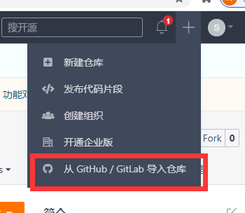

# GIT 技巧总结

[官方文档](https://training.github.com/downloads/zh_CN/github-git-cheat-sheet/)

##  如何将自己fork的代码更新到最新的代码

作者[Thomas]

我们经常会遇到自己之前做的项目突然就跟不上主分支了。这个时候我们只要按照以下步骤来操作即可。

我们以RT-Thread来举例说明

第一步，将RT-Thread官方路径添加到upstream中

```
git remote add upstream https://github.com/RT-Thread/rt-thread.git
```

第二步，将官方的最新代码更新下来

```
git fetch upstream
```

第三步，将最新的代码下载同步下来，

```
git checkout upstream/master
```

第四步，创建一个本地的分支

```
git checkout -b new_master
```

第五步，这个时候我们就拥有了最新的代码的分支，提交到github上面去

```
git push origin new_master:old_master
```

这边需要注意的是，上面的命令old_master如果是你fork仓库中已经有的分支，需要加-f来强制push。如果是一个新的分支则你的fork仓库会创建一个分支，这个时候就是最新的代码了。

第六步，**以下可以操作，也可以不用操作**。并不是必须的，强迫症患者可以看下。

如果你有强迫症的话，想让你fork仓库的master更新到最新的话。

```
git push origin new_master:master -f    
```

如果还有强迫症的话，可能需要把本地的master分支给删了（因为这个是旧的）

```
git branch -D master
```

如果你还有强迫症的话，可以删除调upstream，看起来似乎干净一些

```
git remote remove upstream
```

-----------

## TODO

### git如何删除远端分支

当遇到github上面远端分支需要删除的时候，我们使用下面命令

1. 找到对应的branch

```
git branch -a              
```

2. 删除远端branch

```
git push origin --delete xxx_dev
```

## git如何添加submodule

如果引用第三方库的话，可以使用下面命令添加submodule

```
git submodule add https://xxx.git
```


删除第三方库：

```
git submodule deinit <submodule-name>
```


## github国内如何快速更新代码

本章节主要通过gitee快速方便的更新代码

### 情况一：第一次下载

第一次下载的时候，比如RTTHREAD master上面的源码，

可以先在gitee上面建个仓库



从这里导入仓库地址  https://github.com/RT-Thread/rt-thread.git

导入之后就可以下载了

### 情况二， PR一次之后如果需要将RTTHREAD更新到最新的

可以按照上面的来更新到最新的branch

### 情况三，本地fork的分支已经在远端更新了，但是本地git pull太慢

这种情况，主要原因是因为github没有同步按钮，先将gitee上面的老的分支先同步一下，


然后把gitee的branch先fetch下来

```
git fetch giteestream
```

这样本地就有新的代码了，

之后再执行git pull

会发现很快就更新完成了。


### github如何贡献代码

### github如何修改代码之后再次提交

### git如何正确使用分支

### git的原理本质

### git如何正确管理自己的仓库和分支

原则一： 将比较大的repo仓库统一管理，方便维护

### git通用行为准则

